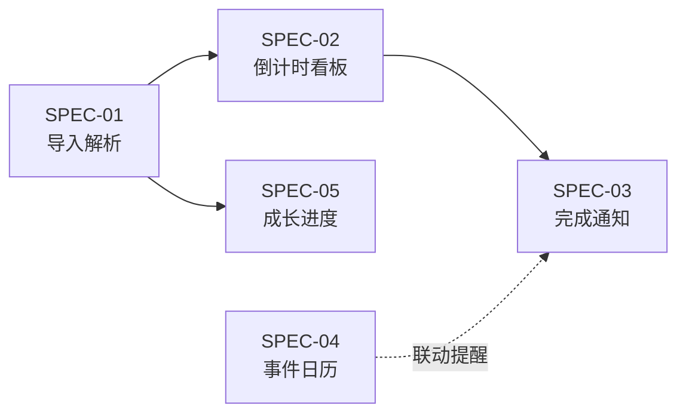

# 核心功能 Spec · 索引

> 状态：Draft · 2026-09-28 · 对应《功能调研清单》v1.0
> 本阶段只定义产品与规格，**不写代码**。

---

## 1. 产品定位

**工作名**：工头（暂定，正式命名需避开 “Clash of Clans” 商标）

**一句话**：把游戏内「村庄数据导出」变成中文的建筑工 / 实验室倒计时看板，并在升级完成时提醒你。

**目标用户**：中重度主世界玩家，同时跑多条升级线，希望「工人别空转、实验室别停、到点有人叫」。

**形态（MVP）**：移动端优先的单页 Web App（可 PWA），数据默认纯本地，不要求账号。

**合规底线**（全 Spec 共用）：

1. 仅使用：官方 API、官方游戏内 JSON 导出、用户手动录入、公开资料（Wiki 等）。
2. 不做：内存读取、协议破解、自动操作、常驻 OCR。
3. 产品名与文案避免直接使用 “Clash of Clans” 作产品名；页脚声明非官方、遵循 Supercell Fan Content Policy。
4. 官方 API Token 不进客户端；MVP 阶段核心链路**不依赖官方 API**。

---

## 2. 核心问题（来自调研清单 §0）

| # | 用户问题 | 对应 Spec | 可行性 |
|---|---|---|---|
| ① | 每个建筑工还剩多久升级完？ | SPEC-02 | 游戏内 JSON 导出含进行中升级 `timer` |
| ② | 实验室正在研究什么、还剩多久？ | SPEC-02 | 同上 |
| ③ | 某项升级完成时通知我 | SPEC-03 | 由 `finishAt` 排程本地 / Web Push |

**数据前提**：官方 REST API **不返回**建筑明细与升级倒计时；唯一官方完整来源是游戏内导出：

> 设置 → 更多设置 → Data Export → Copy  
> 深链：`https://link.clashofclans.com/en/?action=OpenMoreSettings`

导出是**粘贴那一刻的快照**，升级后需重新导出。

---

## 3. Spec 一览

| 文档 | 覆盖 | 优先级 | 依赖 |
|---|---|---|---|
| [SPEC-01 村庄数据导入与解析](./SPEC-01-村庄数据导入与解析.md) | 粘贴导出、解析、本地存储、快照语义 | P0 | — |
| [SPEC-02 建筑工与实验室倒计时](./SPEC-02-建筑工与实验室倒计时.md) | 工人/实验室卡片、实时倒计时、空闲提示 | P0 | SPEC-01 |
| [SPEC-03 升级完成通知](./SPEC-03-升级完成通知.md) | 到点提醒、提前提醒、开关与免打扰 | P0 | SPEC-01、02 |
| [SPEC-04 公开事件日历](./SPEC-04-公开事件日历.md) | 赛季/部落冲突/都城周末等倒计时与提醒 | P0 | 无（纯规则） |
| [SPEC-05 成长进度](./SPEC-05-成长进度.md) | 英雄/兵种进度、建筑完成度、「差多少满本」 | P0/P1 | SPEC-01 |

---

## 4. 本阶段明确不做

| 不做 | 原因 | 何时再开 |
|---|---|---|
| 官方 API 接入 / 后端代理 | MVP 核心链路可离线完成 | SPEC-05 强化自动刷新时 |
| 云同步、账号体系 | 纯本地即可用 | 第二阶段 |
| 升级规划器 / 优化器 / Gantt | 依赖更重的静态库与算法 | 第三阶段 |
| 部落战 / CWL / 都城看板 | 与三个核心问题无关 | 第二阶段 |
| AI 问答 / MCP | 同上 | 第三阶段 |
| 原生 App / APNs / FCM | Web 即可验证价值 | 上架时 |

---

## 5. 术语

| 术语 | 含义 |
|---|---|
| 村庄导出 / Export | 游戏内 Data Export 复制出的 JSON 快照 |
| Job / 升级任务 | 一条「正在升级」记录（建筑、实验室研究、英雄等） |
| `remainingSec` | 导出时该任务剩余秒数 |
| `finishAt` | `importedAt + remainingSec`，任务预计完成时刻（本地时钟） |
| Lane / 车道 | 一条占用中的工作线：普通工人、哥布林工、实验室、助手等 |
| Boost | 加速状态（工人/实验室药水、钟楼、零食等） |
| 静态游戏库 | 满级表、升级时间费用表（来源 coc.guide / Wiki） |

---

## 6. 通用非功能要求

| 项 | 要求 |
|---|---|
| 平台 | 移动端优先（375–430px 宽），桌面可读 |
| 性能 | 导入解析 < 300ms（万级字段 JSON）；倒计时 UI 不掉帧 |
| 时间 | 一律本地时区展示；跨时区用户以设备时钟为准 |
| 离线 | 解析、倒计时、本地通知不依赖网络 |
| 隐私 | 导出原文与解析结果仅存本机；不上传 |
| 可访问性 | 倒计时文本可读（非纯进度条）；支持系统字号 |
| 合规 | 见 §1；隐私说明写明「数据不出设备」 |

---

## 7. 验收总览（本阶段文档层面）

- [ ] 三个核心问题在 spec 中均有对应 FR 与验收标准
- [ ] 数据源边界（导出有 / API 有 / 只能手动）写清
- [ ] 通知不依赖服务端也可工作（本地路径完整）
- [ ] 明确快照过期、Boost 偏差、Forge/Helper 检测不到等局限的产品处理方式
- [ ] 每份 Spec 有可勾选的验收清单，便于实现后回归

---

## 8. 开放问题（实现前需拍板）

1. 产品正式命名与视觉基调（暗色游戏风 vs 工具清爽风）。
2. 多账号：MVP 是否只支持单村庄（建议是，降低复杂度）。
3. 静态游戏库：内置打包 vs 首次启动下载；版本如何跟游戏更新。
4. 通知渠道默认策略：MVP 仅 Notification API，还是同时做 PWA Web Push。
5. 金卡折扣默认开或关（影响时间估算口径）。
