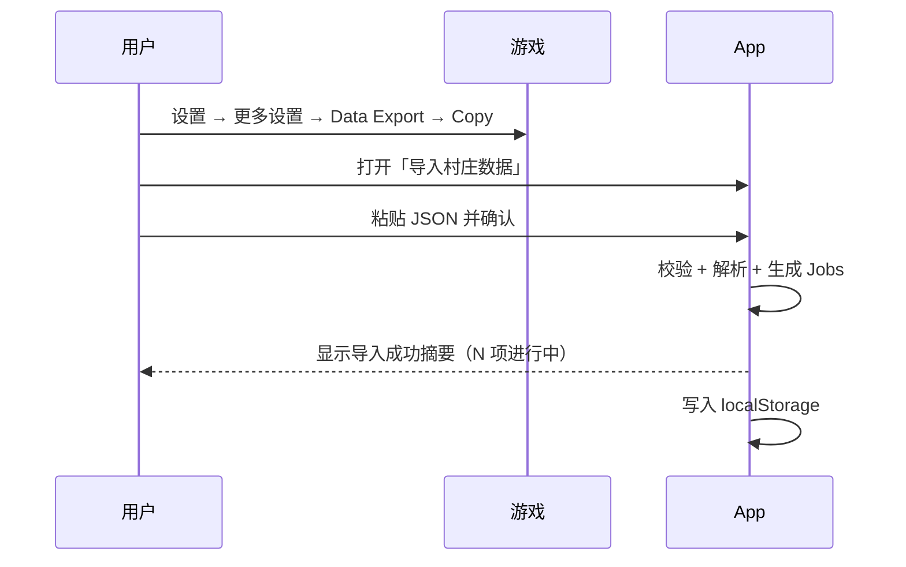

# SPEC-01 · 村庄数据导入与解析

> 状态：Draft · 优先级：**P0** · 依赖：无（数据底座）  
> 上游：《功能调研清单》§3 游戏内 JSON 村庄导出 · §9 技术要点  
> 下游：SPEC-02 倒计时、SPEC-03 通知、SPEC-05 成长进度

---

## 1. 背景与目标

官方 REST API **不返回**建筑等级明细、城墙/陷阱、进行中升级与实验室研究的剩余时间。  
用户能拿到的唯一官方完整私有数据，是游戏内 **Data Export** 复制出的 JSON 快照。

本 Spec 定义：用户如何把导出数据安全地放进 App，App 如何解析、存储、判断新鲜度，并向上游功能提供统一数据模型。

**目标**：

1. 用户 30 秒内完成「复制 → 粘贴 → 看到自己的升级任务」。
2. 解析结果可离线使用，刷新页面不丢。
3. 数据模型稳定，后续功能不直接摸原始 JSON。

**非目标**：

- 不自动读取剪贴板常驻监控（用户明确粘贴才处理）。
- 不上传导出原文到任何服务器。
- 不在此 Spec 实现倒计时 UI / 通知（见 02 / 03）。

---

## 2. 范围

### In Scope

| 项 | 说明 |
|---|---|
| 粘贴导入 | 文本框粘贴 / 粘贴板导入，识别 JSON |
| 解析 | buildings / traps / units / spells / heroes / pets / equipment / boosts / helpers 等 |
| 任务抽取 | 从带 `timer` 的条目生成统一 Job 列表 |
| 本地持久化 | 当前村庄快照 + 导入元信息 |
| 快照语义 | 展示导入时间、过期提示、重新导入覆盖 |
| 手动补录（最小） | 对导出缺失项提供可选手动字段（Helper、Boost 折扣） |
| 校验与报错 | 非 JSON、字段缺失、版本不识别时的用户可读错误 |

### Out of Scope

| 项 | 原因 / 去向 |
|---|---|
| 官方 API 玩家数据合并 | MVP 核心不依赖 API |
| 多村庄并行管理 | 建议 MVP 单村庄；多账号见 SPEC-05 / 阶段二 |
| 云备份 | 阶段二 |
| 从分享链接导入 | 无官方分享导出格式 |

---

## 3. 用户与场景

| 角色 | 场景 |
|---|---|
| 回归玩家 | 升级开始后重新导出，刷新倒计时与等级 |
| 多线玩家 | 一次导入后，查看 5 个工人 + 实验室是否在干活 |
| 谨慎用户 | 不想登录、不想给 API Key，只用本地粘贴 |

**主流程（Happy Path）**



---

## 4. 功能需求

### FR-1.1 导入入口与方式

| ID | 需求 | 优先级 |
|---|---|---|
| FR-1.1.1 | 提供「粘贴村庄数据」页面/面板，支持多行文本粘贴 | P0 |
| FR-1.1.2 | 提供「从剪贴板粘贴」快捷按钮（需浏览器权限） | P1 |
| FR-1.1.3 | 提供游戏深链文案引导：`https://link.clashofclans.com/en/?action=OpenMoreSettings`，并说明路径「设置 → 更多设置 → Data Export → Copy」 | P0 |
| FR-1.1.4 | 支持「示例数据」试玩（便于未导出用户理解界面） | P2 |
| FR-1.1.5 | 支持从本地 `.json` 文件选择导入 | P1 |

### FR-1.2 校验

| ID | 需求 | 优先级 |
|---|---|---|
| FR-1.2.1 | 识别合法 JSON；失败时提示「内容不是有效的村庄导出」 | P0 |
| FR-1.2.2 | 识别疑似导出结构（至少含 `buildings` 或若干已知 section） | P0 |
| FR-1.2.3 | 未知/新增字段：保留原始字段到 `_raw`，不因未知字段失败 | P0 |
| FR-1.2.4 | 必填区块缺失时给出分级警告（见 §8） | P1 |
| FR-1.2.5 | 导入体积上限提示（建议 > 2MB 时警告） | P2 |

### FR-1.3 解析与数据模型

解析目标是对齐 coc.py `AccountData` 的语义，但产出**本产品自有稳定模型**（见 §5），避免 UI 依赖上游 SDK。

| ID | 需求 | 优先级 |
|---|---|---|
| FR-1.3.1 | 解析 `buildings[]`：建筑 ID、当前等级、数量、大本武器 `weapon`、`supercharge`、季节防御 `types` | P0 |
| FR-1.3.2 | 解析 `traps[]` | P0 |
| FR-1.3.3 | 解析 `units` / `siege_machines` / `spells` / `heroes` / `pets` / `equipment` 的等级与 `timer` | P0 |
| FR-1.3.4 | 解析 `buildings2` 等夜世界区块，标记 `village: home \| builder` | P1 |
| FR-1.3.5 | 解析 `boosts`：`builder_boost`、`lab_boost`、`clocktower_boost`、`clocktower_cooldown`、`builder_consumable`、`lab_consumable`、`helper_cooldown` | P1 |
| FR-1.3.6 | 解析 `helpers[]`（若版本包含） | P2 |
| FR-1.3.7 | 解析收藏类字段 `skins` / `sceneries` / `house_parts` 仅入库，不做 UI（本 Spec） | P3 |
| FR-1.3.8 | 从所有含 `timer` 的条目抽取 Job：`section`、`itemId`、`level`、`remainingSec`、`isGoblin`、`helperRemainingSec` | P0 |

### FR-1.4 持久化

| ID | 需求 | 优先级 |
|---|---|---|
| FR-1.4.1 | 将解析结果存入 `localStorage`（或 IndexedDB，实现自定），刷新后可恢复 | P0 |
| FR-1.4.2 | 存储导入元信息：`importedAt`、来源（粘贴/文件）、`sourceHash` | P0 |
| FR-1.4.3 | 再次导入成功后**整体覆盖**当前村庄（不做增量合并，避免脏状态） | P0 |
| FR-1.4.4 | 提供「清除本地数据」危险操作（二次确认） | P0 |
| FR-1.4.5 | 提供「导出我的追踪数据」JSON 备份（含设置、手动补录） | P1 |
| FR-1.4.6 | 内存中保留最近一次原始 JSON（便于调试/重解析），可不持久化原文 | P2 |

### FR-1.5 快照与新鲜度

| ID | 需求 | 优先级 |
|---|---|---|
| FR-1.5.1 | 全局展示「数据更新于 …」 | P0 |
| FR-1.5.2 | 导入超过 **24h** 显示弱提示；超过 **72h** 显示强提示「升级状态可能已变化，请重新导出」 | P1 |
| FR-1.5.3 | 重新导入后清空过期提示，并重算所有 `finishAt` | P0 |
| FR-1.5.4 | 支持「对比上次导入」：等级变化、新增/消失的 Job（文本摘要即可） | P2 |

### FR-1.6 手动补录（最小集）

导出官方局限：Forge 工人、Helper 等级/冷却、药水/金卡 Boost 可能缺失或偏差。

| ID | 需求 | 优先级 |
|---|---|---|
| FR-1.6.1 | 可手动设置金卡/活动 Boost 折扣：0 / 10 / 15 / 20% | P1 |
| FR-1.6.2 | 可手动标记「工人药水 / 实验室药水剩余时间」用于倒计时校准 | P1 |
| FR-1.6.3 | 手动值与导出冲突时，以**手动值优先**并标注来源 | P1 |
| FR-1.6.4 | 可手动新增一条「自定义升级任务」（无法从导出识别时） | P2 |

---

## 5. 数据模型

> 实现语言无关；字段命名稳定后供 02/03/05 引用。

### 5.1 VillageSnapshot

```jsonc
{
  "schemaVersion": 1,
  "importedAt": "2026-09-28T12:00:00.000Z",
  "source": "paste",              // paste | file | sample
  "sourceHash": "sha256:…",
  "accountLabel": "主号",           // 用户可改
  "buildings": [ /* Building */ ],
  "traps": [ /* Trap */ ],
  "units": [ /* LeveledItem */ ],
  "spells": [ /* LeveledItem */ ],
  "heroes": [ /* LeveledItem */ ],
  "pets": [ /* LeveledItem */ ],
  "equipment": [ /* LeveledItem */ ],
  "jobs": [ /* Job */ ],
  "boosts": { /* BoostState */ },
  "helpers": [],
  "meta": {
    "village": "home",            // home | builder
    "rawSections": ["buildings", "units", "..."],
    "warnings": ["helpers_missing"]
  }
}
```

### 5.2 Job（升级任务）

```jsonc
{
  "id": "job_b7_12",              // 稳定 id：section + itemId + level
  "kind": "building" | "unit" | "spell" | "hero" | "pet" | "equipment" | "custom",
  "section": "buildings",
  "itemId": 1000001,              // 导出内 data/id
  "displayName": "箭塔",           // 由静态库映射；失败则显示原始 id
  "currentLevel": 11,
  "targetLevel": 12,
  "village": "home",
  "lane": "builder" | "lab" | "goblin" | "helper" | "unknown",
  "remainingSecAtImport": 3600,
  "importedAt": "2026-09-28T12:00:00.000Z",
  "finishAt": "2026-09-28T13:00:00.000Z",  // importedAt + remainingSec
  "isGoblin": false,
  "helperRemainingSec": null,
  "boostAppliedAtImport": "none", // none | builder | lab | …
  "source": "export" | "manual"
}
```

**规则 R-1**：`finishAt = importedAt + remainingSecAtImport`。  
**规则 R-2**：`lane` 推断：`buildings*` → builder；`units/spells/pets/equipment` 研究 → lab；带 `isGoblin` → goblin；无法判定 → `unknown`，UI 收入「其他进行中」。  
**规则 R-3**：同一时刻同 `lane` 多条 Job 不强制去重（导出可能含助手并行）；UI 见 SPEC-02。

### 5.3 BoostState

```jsonc
{
  "builderBoostRemainingSec": 0,
  "labBoostRemainingSec": 0,
  "clockTowerBoostRemainingSec": 0,
  "clockTowerCooldownSec": 0,
  "builderConsumable": null,
  "labConsumable": null,
  "helperCooldownSec": null,
  "manualGoldPassDiscountPct": 0,   // 0/10/15/20
  "manualNotes": ""
}
```

---

## 6. 交互与信息架构

### 6.1 页面：导入 / 更新

1. **引导区**（可折叠）：三步图示「游戏内 Copy → 这里粘贴 → 看倒计时」。
2. **输入区**：大文本框 + 「解析并导入」主按钮 + 「从剪贴板粘贴」。
3. **解析预览**（导入成功前）：显示将识别到的 Job 数、建筑数、警告列表；用户确认后写入。
4. **成功态**：摘要卡片「已导入 · N 项进行中 · 更新于刚刚」，并引导去「倒计时」页。
5. **失败态**：错误原因 + 「查看示例」+ 重新粘贴。

### 6.2 全局数据状态条（App 壳层）

- 左：`数据更新于 2 小时前`
- 右：`重新导入` / `清除`
- 过期时变色并可点进导入页

---

## 7. 与静态游戏库的接口

静态库（满级表、名称映射、升级时间费用）**不属于**本 Spec 的交付物，但解析层需预留：

| 能力 | 用途 | 缺失时降级 |
|---|---|---|
| `itemId → displayName` | 卡片标题 | 显示 `未知建筑 #id` |
| `itemId + level → maxLevel` | 进度 | 隐藏满级差 |
| `itemId + level → nextUpgrade` | 时间/费用 | 不展示下一级 |

实现上：名称映射优先（P0 可用简表）；完整升级表可后置到 SPEC-05。

---

## 8. 异常与边界

| 场景 | 处理 |
|---|---|
| 粘贴了非 JSON 文本 | 阻断，提示重新复制 Data Export |
| JSON 合法但不像导出 | 阻断，列出期望字段 |
| 仅有部分 section | 允许导入，`warnings` 标注缺失，倒计时页对缺失模块显示空态 |
| `timer = 0` | 任务视为「已完成/即将完成」，`finishAt ≈ now`，通知侧仍可排一次 |
| `timer` 为负数 | 视为 0，警告 |
| 系统时钟被改 | `finishAt` 基于导入时刻与剩余秒；若 `Date.now()` 与 `importedAt` 逻辑矛盾（now < importedAt），提示校时并暂停通知排程 |
| 重复导入同一内容 | 覆盖并刷新 `importedAt`（倒计时会整体重算——**接受此行为**，并在 UI 说明「每次导入都以当时剩余时间为准」） |
| localStorage 配额满 | 提示清除旧数据或导出备份 |
| 私密性 | 导出文本不经网络；错误日志不得包含完整 JSON |

---

## 9. 验收标准

- [ ] **AC-1.1** 用户粘贴合法导出后，能在 1 个屏内看到「N 项进行中」摘要。
- [ ] **AC-1.2** 解析产生的每个 Job 均含 `finishAt`，且与 `importedAt + remainingSec` 一致（误差 < 1s）。
- [ ] **AC-1.3** 刷新页面后，快照与 Job 列表仍在，`finishAt` 不变。
- [ ] **AC-1.4** 再次粘贴新导出，旧数据被覆盖，倒计时按新 `timer` 更新。
- [ ] **AC-1.5** 非 JSON 输入被拒绝，且有可读中文错误。
- [ ] **AC-1.6** 未知字段不影响解析成功。
- [ ] **AC-1.7** 断网状态下完成导入、解析、持久化全部可用。
- [ ] **AC-1.8** 「清除本地数据」后，存储中不再残留村庄快照。
- [ ] **AC-1.9** 导出原文未发送到网络（可用 devtools 验证无上传请求）。
- [ ] **AC-1.10** 手动 Boost 折扣设置后，存储中 `manualGoldPassDiscountPct` 正确，并被标记为 manual 来源。

---

## 10. 开放问题

1. `Job.id` 是否需要在重新导入后保持稳定，以便通知历史关联（建议：用 `section+itemId` 作弱关联，不承诺跨导入稳定）。
2. 夜世界 Job 是否进入主列表还是分段（建议 SPEC-02 分栏，见该文档）。
3. 静态名称库内置范围（中文名全集体积 vs 离线可用性）。
4. 是否保留「上次成功解析的原始 JSON」以便热更新解析器（建议 IndexedDB，可后置）。
