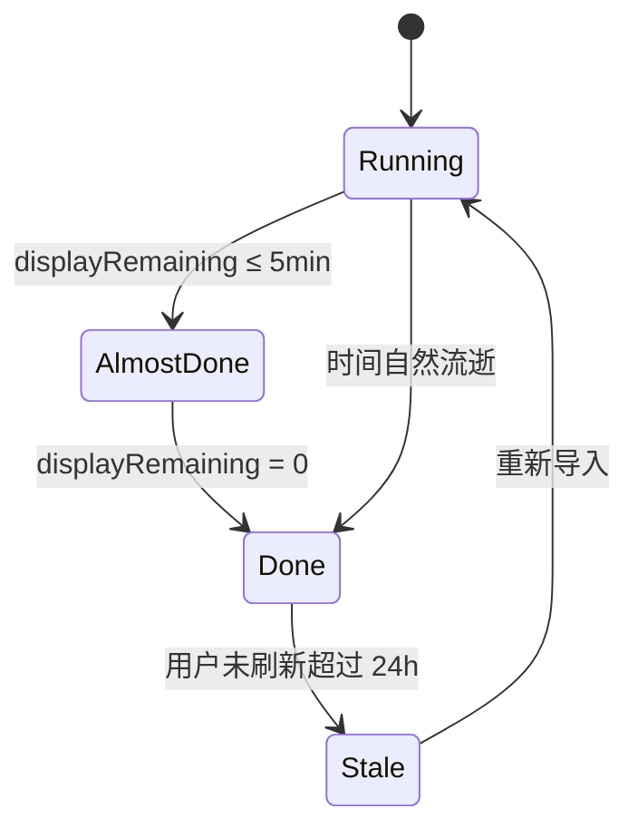

# SPEC-02 · 建筑工与实验室倒计时

> 状态：Draft · 优先级：**P0** · 依赖：SPEC-01（Job / Snapshot）  
> 上游：《功能调研清单》§0 核心①② · §4A  
> 下游：SPEC-03 通知（消费 `finishAt`）、SPEC-04 事件联动文案

---

## 1. 背景与目标

玩家最痛的两个问题：

1. **每个建筑工还剩多久升级完？**（工人别空着）
2. **实验室正在研究什么、还剩多久？**（实验室别停）

官方 API 不给倒计时；游戏内导出的 `timer` 是唯一可靠来源。本 Spec 把 Job 列表变成「一眼能懂」的倒计时看板。

**目标**：

- 打开 App 3 秒内知道：谁在干活、还剩多久、谁快闲了。
- 倒计时本地秒级刷新，切换后台再回来不漂。
- 为通知系统提供稳定、可解释的 `finishAt`。

**非目标**：

- 升级队列规划 / 优化器（阶段三）。
- 甘特图多日排程（阶段二，见 §10）。
- 自动抓取游戏状态（合规红线）。

---

## 2. 范围

### In Scope

| 项 | 说明 |
|---|---|
| 工人卡片 | 每个进行中建筑升级一张卡：名称、等级、剩余时间 |
| 实验室卡片 | 正在研究的兵/法/宠/装 + 剩余时间 |
| 实时倒计时 | 秒级展示；后台恢复校正 |
| 空闲提示 | 「有工人空闲」及已空闲时长 |
| 哥布林工 / 临时工 | 独立车道 |
| 加速状态 | 药水 / 钟楼 / 零食剩余（来自导出 + 手动） |
| 主世界 / 夜世界 | 分栏或分段展示 |
| 完成时刻锚定 | 统一 `finishAt` 口径供通知使用 |

### Out of Scope

| 项 | 去向 |
|---|---|
| 推送/系统通知 | SPEC-03 |
| 赛季/活动倒计时 | SPEC-04 |
| 下一级耗时费用、满本统计 | SPEC-05 |
| 拖拽排队、药水预览、优化器 | 阶段二/三 |
| 战宠屋独立占用建模 | 若导出未单独给出，先并入实验室/其他车道 |

---

## 3. 用户与场景

| 场景 | 用户期望 |
|---|---|
| 早上打开 | 看到「3 号工人还剩 2 小时，实验室还剩 6 小时」 |
| 升级中途重进 | 倒计时与游戏一致（或可解释地接近） |
| 有人刚完成 | 空闲提示：「1 名工人已空闲 40 分钟」 |
| 喝了工人药水 | 可手动校准，避免误导 |
| 夜世界也在跑 | 分栏各看各的 |

**核心页面结构**


---

## 4. 功能需求

### FR-2.1 建筑工看板（核心①）

| ID | 需求 | 优先级 |
|---|---|---|
| FR-2.1.1 | 每个进行中建筑升级展示为一张卡片 | P0 |
| FR-2.1.2 | 卡片内容：建筑名、当前→目标等级、剩余时间（天/时/分/秒）、进度环或进度条 | P0 |
| FR-2.1.3 | 剩余时间格式化：`>1d` → `2天3小时`；`<1h` → `12分34秒`；`<1min` → `34秒` | P0 |
| FR-2.1.4 | 按 `finishAt` 升序排序（最先完成的在前） | P0 |
| FR-2.1.5 | 展示工人占用标识（若导出可区分：普通工 / 哥布林工） | P1 |
| FR-2.1.6 | 点击卡片展开：`itemId`、导入时间、估算完成时刻（本地时间）、是否受 Boost 影响 | P1 |
| FR-2.1.7 | 多条建筑升级并行时，全部展示（不合并） | P0 |

### FR-2.2 实验室看板（核心②）

| ID | 需求 | 优先级 |
|---|---|---|
| FR-2.2.1 | 实验室区展示当前研究项：种类（兵/法/宠/装）、名称、当前→目标等级 | P0 |
| FR-2.2.2 | 与建筑工相同的剩余时间格式 | P0 |
| FR-2.2.3 | 若同时存在多个带 `timer` 的研究相关条目，全部列出并标注来源 section | P1 |
| FR-2.2.4 | 实验室空闲时显示空态：「实验室空闲」+ 建议看事件/进度页 | P1 |
| FR-2.2.5 | 装备升级若占用工人而非实验室，归入建筑工/其他车道（见 R-2） | P1 |

### FR-2.3 实时倒计时

| ID | 需求 | 优先级 |
|---|---|---|
| FR-2.3.1 | 页面可见时每秒刷新显示（基于 `finishAt - now`） | P0 |
| FR-2.3.2 | `visibilitychange` / `focus` 回到前台时立即校正 | P0 |
| FR-2.3.3 | 倒计时 ≤ 0 时：状态变为「已完成」，仍显示卡片直至下次导入或用户关闭 | P0 |
| FR-2.3.4 | 不使用会因节能漂移的展示逻辑：始终以墙钟时间差计算 | P0 |
| FR-2.3.5 | 展示「预计完成：今天 21:35」这样的绝对时间（本地时区） | P1 |

### FR-2.4 空闲与拥挤提示

| ID | 需求 | 优先级 |
|---|---|---|
| FR-2.4.1 | 若有 Job 已完成且未重新导入，显示「可能有工人已空闲」弱提示 | P1 |
| FR-2.4.2 | 若建筑工区为空，显示「当前没有进行中的建筑升级」 | P0 |
| FR-2.4.3 | 汇总条：「最早完成：工人3 · 01:12:45」 | P1 |
| FR-2.4.4 | 「全部完成」庆祝态（可选，低优先级） | P3 |

### FR-2.5 哥布林工 / 助手 / 加速

| ID | 需求 | 优先级 |
|---|---|---|
| FR-2.5.1 | `isGoblin` 的 Job 独立分组「哥布林工」 | P1 |
| FR-2.5.2 | 展示 `helper_timer` / 助手冷却（若数据存在） | P1 |
| FR-2.5.3 | 展示 Boost 区：工人药水、实验室药水、钟楼 Boost/冷却剩余 | P1 |
| FR-2.5.4 | 手动校准药水剩余时间（SPEC-01 FR-1.6）后，在卡片角标「已校准」 | P1 |
| FR-2.5.5 | 明确文案：「加速可能导致游戏内实际完成更早」 | P0 |

### FR-2.6 主世界 / 夜世界

| ID | 需求 | 优先级 |
|---|---|---|
| FR-2.6.1 | 主世界 Job 默认完整展示 | P0 |
| FR-2.6.2 | 夜世界 Job 进入「夜世界」折叠区或 Tab | P1 |
| FR-2.6.3 | 两侧互不影响倒计时计算 | P0 |

---

## 5. 规则与算法

### R-1 完成时刻

```
finishAt = importedAt + remainingSecAtImport
displayRemaining = max(0, finishAt - now)
```

- 不因页面刷新而重置。
- 每次重新导入，所有 Job 的 `finishAt` **重算**（以新快照为准）。

### R-2 车道推断（lane）

| 条件 | lane |
|---|---|
| section ∈ buildings / buildings2 / traps | builder |
| section ∈ units / spells / heroes / pets 的研究 timer | lab |
| section = equipment 且 timer 存在 | builder（默认）* |
| `isGoblin` 为真 | goblin |
| 其他 | unknown |

\* 开放问题：装备升级是否占实验室/工人/专用槽，随导出实测调整。

### R-3 完成状态机



### R-4 Boost 展示口径

- 导出中的 `boosts` 剩余秒数以 `importedAt` 为锚，同样用 `remaining - (now - importedAt)` 推进。
- 手动药水剩余优先于导出值。
- 卡片上的剩余时间**不做** Boost 折算（导出的 `timer` 已是加速后的快照）；折算预览留给阶段三规划器。

---

## 6. 交互与信息架构

### 6.1 首页布局（移动优先）

1. **顶栏**：村庄名 / 数据更新于 / 菜单
2. **总览条**（吸顶）：`最早完成 00:42:15 · 5 个工人 · 实验室：野蛮人 12→13`
3. **建筑工区**：卡片流（竖排列表）
4. **实验室区**：1–N 张卡
5. **其他**：哥布林工、助手、Boost
6. **夜世界**：折叠
7. **空态引导**：去导入 / 看示例

### 6.2 卡片视觉要求

- 剩余时间为**最大字号**信息。
- 完成临近（≤5min）使用强调色但不闪烁骚扰。
- 已完成：降透明度 + 「已完成」徽章。
- 不依赖颜色单独表达状态（无障碍）。

### 6.3 时间显示统一

| 区间 | 格式 |
|---|---|
| ≥ 24h | `2天 3小时` 或 `2天 3:05` |
| 1–24h | `3小时 12分` |
| 1–60min | `12分 34秒` |
| < 60s | `45秒` |

绝对完成时刻用设备 locale（示例：`9月29日 21:35`）。

---

## 7. 接口 / 数据依赖

| 来源 | 用途 |
|---|---|
| SPEC-01 `VillageSnapshot.jobs` | 全部卡片数据 |
| SPEC-01 `BoostState` | 加速区 |
| 本地时钟 | `now` |
| 静态库（可选） | 建筑/兵种中文名 |

无网络依赖。

---

## 8. 异常与边界

| 场景 | 处理 |
|---|---|
| 未导入任何数据 | 全页空态 + 主 CTA「粘贴村庄数据」 |
| Job 的 `displayName` 缺失 | `建筑 #1000001` + 弱提示「名称库未覆盖」 |
| `finishAt` 在过去很久 | 显示已完成 + 「数据较旧，建议重新导出」 |
| 设备休眠错过秒刷新 | 前台恢复按墙钟重算，不累积 setInterval 欠账 |
| 同一 itemId 多条 timer | 分别展示，不合并 |
| 导出有 Boost 但倒计时无任务 | Boost 区可独立显示 |
| 用户手动改系统时间导致 `now < importedAt` | 显示时间异常提示（SPEC-01 FR 同步），倒计时暂停在 0 |

---

## 9. 验收标准

- [ ] **AC-2.1** 导入含 5 个建筑升级 + 1 个实验室研究的样例后，首页出现 6 张卡片。
- [ ] **AC-2.2** 每张卡片剩余时间与 `finishAt - now` 一致（±1s）。
- [ ] **AC-2.3** 切后台 1 分钟再回来，剩余时间正确减少约 60s（墙钟）。
- [ ] **AC-2.4** 卡片按完成时间升序。
- [ ] **AC-2.5** 实验室项单独成区，且与建筑工区文案区分（「研究中」vs「升级中」）。
- [ ] **AC-2.6** 倒计时归零后卡片变为「已完成」，不消失、不报错。
- [ ] **AC-2.7** 无数据空态可一键跳转导入。
- [ ] **AC-2.8** 哥布林工任务不与普通工人混排（P1 通过）。
- [ ] **AC-2.9** 夜世界任务不出现在主世界建筑工列表中（P1）。
- [ ] **AC-2.10** 导出局限有可见说明：「Forge/药水等可能与游戏内略有偏差」。

---

## 10. 开放问题

1. 是否在 MVP 展示「空闲工人已空闲多久」（需要记录完成时间，而不仅是快照）。
2. 装备/战宠屋占用规则需用真实导出样例校准 lane 映射。
3. 是否要「常亮/醒着」模式（玩家挂机看倒计时）。
4. 阶段二甘特图是否复用本 Spec 的 lane 概念作为 Y 轴。

---

## 11. 阶段二预留（不在本次交付）

- 多工人时间轴 / Gantt
- 预计空闲时间线（「3 号工人明天 14:20 空出」）
- 睡眠窗口：不把完成点排在半夜（联动 SPEC-03 免打扰）
- 智能排程建议
