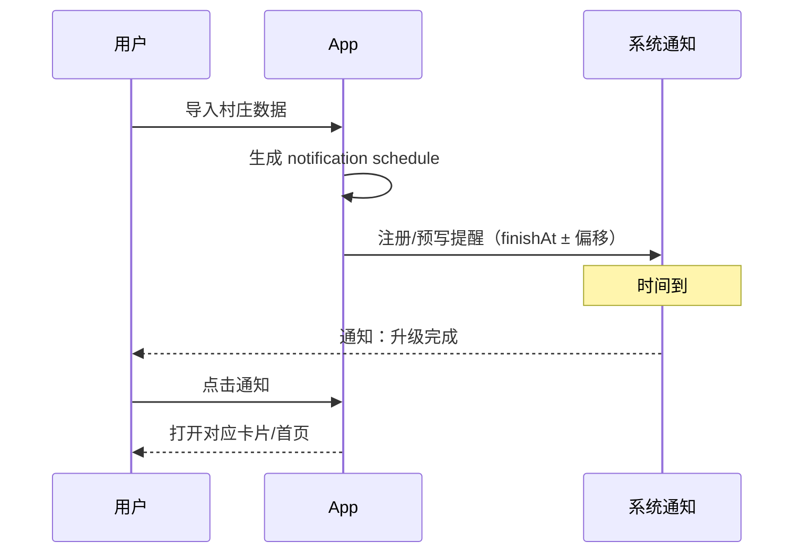

# SPEC-03 · 升级完成通知

> 状态：Draft · 优先级：**P0** · 依赖：SPEC-01（Job / finishAt）、SPEC-02（倒计时语义）  
> 上游：《功能调研清单》§0 核心③ · §4B · §5 通知实现方案  
> 关联：SPEC-04 事件日历可复用同一通知通道

---

## 1. 背景与目标

倒计时解决「还剩多久」；通知解决「到点有人叫我」。  
调研结论：按 `finishAt` 排程即可；MVP 先做**本地通知**，PWA Web Push 作为增强。

**目标**：

1. 升级（建筑/实验室/英雄等）完成时，用户能收到明确提醒。
2. 支持「完成前 X 分钟」预提醒。
3. 用户可按类型开关，并有免打扰，避免半夜被叫醒。
4. **不依赖后端**也能工作（本地路径完整）。

**非目标**：

- 原生 APNs / FCM（上架阶段）。
- 邮件 / Telegram / Discord（社区向，P3）。
- 云端多设备同步（阶段二）。

---

## 2. 范围

### In Scope

| 项 | 说明 |
|---|---|
| 权限引导 | Notification 权限请求时机与文案 |
| 到点提醒 | 基于 `finishAt` 的升级完成通知 |
| 提前提醒 | 可配置提前 15 分钟 / 1 小时等 |
| 类型开关 | 建筑工 / 实验室 / 事件 分组开关 |
| 单条开关 | 每条升级可单独静音（P2） |
| 免打扰 | 睡眠时段静音或合并（P2） |
| App 内反馈 | 打开应用时的 toast + 声音（P1） |
| 通知历史 | 本地最近记录（P2） |
| ICS 导出 | 生成系统日历订阅（P2，辅助） |
| Web Push | PWA 预写队列（P1，可后置） |

### Out of Scope

| 项 | 去向 |
|---|---|
| 服务器推送 / 多设备 | 阶段二 |
| 通知渠道偏好（短信等） | 非目标 |
| 智能改期（自动错峰） | 阶段三 |

---

## 3. 用户与场景

| 场景 | 期望 |
|---|---|
| 升级完成 | 「箭塔 12→13 已完成，可以开始下一项」 |
| 临近完成 | 「实验室还剩 15 分钟：野蛮人 12→13」 |
| 夜间 | 23:00–07:00 不弹；次日汇总或到点不响 |
| 权限被拒 | App 内倒计时仍可用，并温和引导开启系统权限 |
| 重新导入 | 旧排程作废，按新 `finishAt` 重排 |



---

## 4. 功能需求

### FR-3.1 权限与通道

| ID | 需求 | 优先级 |
|---|---|---|
| FR-3.1.1 | 首次进入通知设置时解释用途后再请求权限（不要一上来就弹系统框） | P0 |
| FR-3.1.2 | 权限状态展示：已授权 / 被拒 / 未询问 | P0 |
| FR-3.1.3 | 被拒时提供「去系统设置开启」指引文案 | P0 |
| FR-3.1.4 | iOS PWA：明确提示需「添加到主屏幕」且系统版本支持才可收推送 | P1 |
| FR-3.1.5 | 本地通知通道：标题、正文、标签、点击深链 | P0 |

### FR-3.2 升级完成提醒（核心③）

| ID | 需求 | 优先级 |
|---|---|---|
| FR-3.2.1 | 每个 Job 在 `finishAt` 生成至少 1 条完成提醒 | P0 |
| FR-3.2.2 | 通知内容含：对象名称、等级变化、车道（建筑工/实验室） | P0 |
| FR-3.2.3 | 通知可点击打开 App 并定位到对应卡片/分区 | P1 |
| FR-3.2.4 | Job 重新导入后：取消旧 schedule，按新数据重排 | P0 |
| FR-3.2.5 | Job 用户手动标「已忽略」后不再提醒 | P2 |
| FR-3.2.6 | 同时到期的多条提醒可合并为一条摘要 | P1 |

### FR-3.3 提前提醒

| ID | 需求 | 优先级 |
|---|---|---|
| FR-3.3.1 | 全局默认提前量：关 / 5 分 / 15 分 / 1 小时 / 自定义 | P0 |
| FR-3.3.2 | 提前提醒与完成提醒是两条独立通知 | P0 |
| FR-3.3.3 | 进度很短（如 < 10 分钟）时自动跳过不合理的 1 小时提前量 | P1 |
| FR-3.3.4 | 每条 Job 可覆盖全局提前量（P2） | P2 |

### FR-3.4 开关与免打扰

| ID | 需求 | 优先级 |
|---|---|---|
| FR-3.4.1 | 分组开关：建筑工 / 实验室 / 其他进行中 / 事件（事件对接 SPEC-04） | P0 |
| FR-3.4.2 | 全局一键静音（保留 App 内提示） | P1 |
| FR-3.4.3 | 免打扰时段（默认 23:00–07:00，可改） | P2 |
| FR-3.4.4 | 免打扰策略可选：完全静音 / 延迟到结束后汇总 / 仅完成不提前 | P2 |
| FR-3.4.5 | 单条升级铃铛开关 | P2 |

### FR-3.5 App 内反馈

| ID | 需求 | 优先级 |
|---|---|---|
| FR-3.5.1 | 应用打开时，若存在刚完成的 Job，弹 toast 并标记卡片 | P1 |
| FR-3.5.2 | 可选提示音（默认轻提示，可关） | P2 |
| FR-3.5.3 | 前台可见时避免再弹系统通知（防重复） | P1 |

### FR-3.6 排程策略（实现约束）

| ID | 需求 | 优先级 |
|---|---|---|
| FR-3.6.1 | 预写未来 **7 天** 提醒队列；用户每次打开 App 补满 | P1 |
| FR-3.6.2 | 超过 7 天的 Job：仅记录 `finishAt`，到窗口内再排 | P1 |
| FR-3.6.3 | 浏览器/系统对通知数量有限制时，优先保留「最近完成」的提醒 | P1 |
| FR-3.6.4 | 本地路径：`Notification` + `setTimeout`/`showTrigger`（视支持度）均可，但**验收以到点提醒为准** | P0 |

### FR-3.7 ICS 辅助通道

| ID | 需求 | 优先级 |
|---|---|---|
| FR-3.7.1 | 一键导出 `.ics`：每个 Job 一条日历事件（开始=导入，结束=finishAt） | P2 |
| FR-3.7.2 | 事件日历（SPEC-04）也可导出 | P2 |

### FR-3.8 Web Push（P1，可后置）

| ID | 需求 | 优先级 |
|---|---|---|
| FR-3.8.1 | PWA + Web Push 订阅成功后，将 7 天队列交给 Push 服务 | P1 |
| FR-3.8.2 | 无服务端时自动降级为纯本地 | P0 |
| FR-3.8.3 | 多设备同步明确为「未实现」，避免用户预期错误 | P0 |

---

## 5. 通知文案规范

| 类型 | 标题 | 正文示例 |
|---|---|---|
| 完成 · 建筑 | 升级完成 | 箭塔 12→13 已完成，工人可以接下一项 |
| 完成 · 实验室 | 研究完成 | 野蛮人 12→13 研究完成 |
| 提前 | 还有 15 分钟 | 实验室：野蛮人 12→13 即将完成 |
| 汇总 | 3 项升级已完成 | 打开看看有哪些工人空闲了 |
| 事件（04） | 部落冲突还有 1 小时开始 | 别忘了领积分 |

要求：

- 中文为主，短句，不堆参数。
- 标题 ≤ 20 字，正文 ≤ 60 字更佳。
- 同类通知去重，避免每秒重复。

---

## 6. 交互与信息架构

### 6.1 设置页：通知

1. 权限状态卡 + 主 CTA
2. 默认提前量
3. 分组开关
4. 免打扰时段
5. 通知历史（P2）
6. 导出 ICS（P2）
7. 说明文：「提醒可能因系统省电策略略有延迟」

### 6.2 空态 / 失败

- 未授权：设置页高亮，倒计时页顶部一条弱提示。
- 通知失败：静默降级，设置页显示「上次排程失败，点击重试」。

---

## 7. 数据模型

```jsonc
{
  "notifySettings": {
    "enabled": true,
    "defaultLeadMinutes": 15,
    "groups": {
      "builder": true,
      "lab": true,
      "other": true,
      "event": true
    },
    "quietHours": { "enabled": false, "start": "23:00", "end": "07:00" },
    "quietPolicy": "silent",     // silent | digest | completeOnly
    "perJobMute": ["job_b7_12"],
    "sound": false
  },
  "scheduled": [
    {
      "jobId": "job_b7_12",
      "type": "complete" | "lead" | "event",
      "fireAt": "2026-09-28T13:00:00.000Z",
      "payload": { "title": "升级完成", "body": "…" }
    }
  ]
}
```

**规则 N-1**：`fireAt_complete = finishAt`；`fireAt_lead = finishAt - lead`。  
**规则 N-2**：免打扰命中时按 `quietPolicy` 处理，不丢任务（可延后/合并）。  
**规则 N-3**：任何重新导入 → 重建 `scheduled`。

---

## 8. 异常与边界

| 场景 | 处理 |
|---|---|
| 权限拒绝 | 不阻断主功能；设置页可再引导 |
| 系统杀后台，setTimeout 不可靠 | 依赖打开 App 补排 + 展示「可能有错过提醒」；Web Push 为增强 |
| finishAt 落在过去 | 不补发吵闹通知；最多一条「错过汇总」 |
| 同一时刻 10+ 完成 | 合并通知 |
| 时区变更 | 以绝对时间戳通知；文案中的时刻按新时区显示 |
| 用户关闭所有分组 | 设置页显示「全部静音中」 |
| 药水导致实际更早完成 | 提醒仍按快照 `finishAt`；文案可附「若使用加速可能更早」 |

---

## 9. 验收标准

- [ ] **AC-3.1** 未授权时，App 内倒计时仍完整可用。
- [ ] **AC-3.2** 授权后，对 `finishAt = now + 30s` 的测试 Job 能在到点附近收到通知（允许系统延迟）。
- [ ] **AC-3.3** 设置提前 15 分钟后，能在完成前收到 lead 通知且不重复轰炸。
- [ ] **AC-3.4** 关闭「实验室」组后，实验室 Job 不再产生系统通知（App 内仍显示倒计时）。
- [ ] **AC-3.5** 重新导入后，旧通知被取消，新通知按新 finishAt。
- [ ] **AC-3.6** 免打扰开启时，落在窗口内的通知按策略处理且有设置说明。
- [ ] **AC-3.7** 无网络、无账号情况下完成以上流程。
- [ ] **AC-3.8** 通知点击可打开 App 到相关区域（P1）。
- [ ] **AC-3.9** ICS 导出后可在系统日历看到事件（P2）。
- [ ] **AC-3.10** 不出现「每秒重复通知」或完成后无限重播。

---

## 10. 通知方案对照（决策记录）

| 方案 | 采用阶段 | 说明 |
|---|---|---|
| 本地 Notification | **MVP 主路径** | 无后端、隐私好 |
| PWA Web Push | P1 | iOS 需主屏；队列 7 天 |
| ICS 日历 | P2 辅助 | 零安装系统级，但不智能 |
| APNs/FCM | 上架后 | 最可靠，成本高 |
| 邮件 / Discord | 可选 | 不做个人主路径 |

---

## 11. 开放问题

1. 免打扰默认策略选 `silent` 还是 `digest`（建议 silent，更不扰民）。
2. 提前量默认 15 分钟是否合适（玩家战宠/英雄可用性场景可能更想要 1 小时）。
3. 是否需要「完成声音包」差异化（产品向，P2+）。
4. Web Push 是否需要匿名账号体系（若做多设备）。
