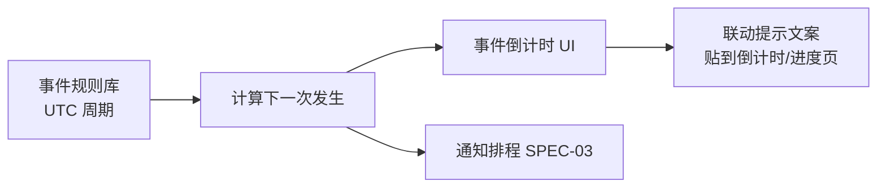
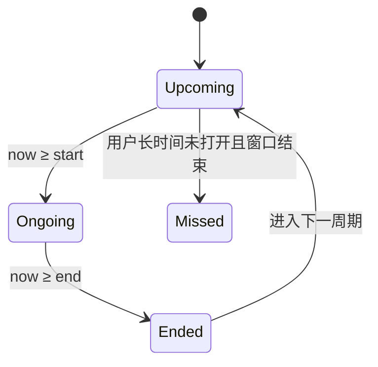

# SPEC-04 · 公开事件日历

> 状态：Draft · 优先级：**P0**（日历与倒计时）/ P1（通知联动） · 依赖：无（纯公开规则）  
> 上游：《功能调研清单》§4H · §6 差异化  
> 关联：SPEC-03 复用通知通道；SPEC-02/05 可展示「事件建议」文案

---

## 1. 背景与目标

升级倒计时解决「我自己的进度」；公开事件日历解决「游戏世界正在发生什么」。  
事件规则来自公开周期（赛季、部落冲突、CWL、都城周末等），**不需要**任何私有数据或 API，是零数据也能用的获客与日活功能。

**目标**：

1. 打开 App 就知道「下一个官方事件是什么、还剩多久」。
2. 与升级提醒共用一套通知，避免两套推送体系。
3. 给升级决策提供约束（例如 CWL 报名期别排英雄——文案级即可，不做规划器）。

**非目标**：

- 官方活动爬虫 / 商店商品监控。
- 奖牌活动、Hammer Jam 等**无固定日历**的活动运营（P2，需人工配置）。
- 战争对手预测。

---

## 2. 范围

### In Scope

| 事件 | 周期（UTC） | 通知点 |
|---|---|---|
| 赛季结束 / Hoggy Bank 结算 | 每月 1 日 08:00 | 前 24h、结算、溢出提醒 |
| 部落冲突 Clan Games | 每月 22–28 日 08:00，约 6 天 | 开始、中期积分、领奖截止 |
| CWL 报名窗口 | 每月 1 日 08:00 起约 2 天 | 报名开/关；提示英雄占用 |
| 都城袭击周末 | 周末窗口（按公开规则） | 开始、最后进攻提醒、结算 |
| 联赛重置 | 约 28 天周期，05:00 | 重置前冲杯提示 |
| Trader / 商店刷新 | 每周 | 刷新提醒（P2） |
| 金卡 Boost 临期 | 赛季末 | 提醒开长升级（P2） |

### Out of Scope

| 项 | 说明 |
|---|---|
| 非周期性官方活动日历运营 | 需要人工维护，P2 |
| 活动攻略内容 | 知识库/I 模块 |
| 与真实账号金卡状态联动 | API/导出都不稳定，仅文案级 |

---

## 3. 用户与场景

| 场景 | 期望 |
|---|---|
| 月底 | 「部落冲突明天 08:00 开始，记得留时间打积分」 |
| 月初 | 「赛季今晚结算，Hoggy Bank 别爆仓」 |
| 周五晚 | 「都城袭击周末开始」 |
| CWL 报名期 | 「报名中，这两天尽量别升级英雄」 |



---

## 4. 功能需求

### FR-4.1 事件规则库

| ID | 需求 | 优先级 |
|---|---|---|
| FR-4.1.1 | 内置周期规则：名称、类型、UTC 发生规则、持续时长、通知偏移 | P0 |
| FR-4.1.2 | 规则可热更新（静态 JSON），便于游戏官方调整 | P1 |
| FR-4.1.3 | 每条规则带来源注释（调研清单 / clash.ninja 周期文） | P1 |
| FR-4.1.4 | 无法确定的事件（Trader 确切时刻）标记 `approximate: true` | P1 |
| FR-4.1.5 | 用户可关闭单个事件类型的日历显示 | P1 |

### FR-4.2 事件倒计时列表（核心 UI）

| ID | 需求 | 优先级 |
|---|---|---|
| FR-4.2.1 | 按「下一次发生时间」排序展示 | P0 |
| FR-4.2.2 | 每条显示：名称、开始/结束时间（本地）、剩余时间、状态（未开始/进行中/已结束） | P0 |
| FR-4.2.3 | 「进行中」高亮，并显示剩余可参与时间 | P0 |
| FR-4.2.4 | 首页可放「下一个事件」摘要条 | P1 |
| FR-4.2.5 | 详情展开：规则说明、建议（如 CWL 别排英雄） | P1 |

### FR-4.3 赛季结束（P0 子集）

| ID | 需求 | 优先级 |
|---|---|---|
| FR-4.3.1 | 显示当前赛季截止时刻与倒计时 | P0 |
| FR-4.3.2 | 结算前 24h 通知 | P0 |
| FR-4.3.3 | 文案提醒：资源/奖章可能溢出 | P1 |
| FR-4.3.4 | 金卡 Boost 临期提醒（P2） | P2 |

### FR-4.4 部落冲突 Clan Games（P0 子集）

| ID | 需求 | 优先级 |
|---|---|---|
| FR-4.4.1 | 展示活动窗口（开始/结束） | P0 |
| FR-4.4.2 | 开始通知、结束前领奖截止通知 | P0 |
| FR-4.4.3 | 「还剩 N 天可打积分」 | P1 |

### FR-4.5 CWL / 都城 / 联赛

| ID | 需求 | 优先级 |
|---|---|---|
| FR-4.5.1 | CWL 报名开/关时间与提示 | P1 |
| FR-4.5.2 | 报名期联动文案：「英雄升级中可能影响出战」 | P1 |
| FR-4.5.3 | 都城周末开始/最后进攻/结算 | P1 |
| FR-4.5.4 | 联赛重置前提示 | P1 |

### FR-4.6 通知联动

| ID | 需求 | 优先级 |
|---|---|---|
| FR-4.6.1 | 事件通知走 SPEC-03 的 `event` 分组 | P0 |
| FR-4.6.2 | 事件通知同样支持免打扰 | P1 |
| FR-4.6.3 | 事件提醒不与升级完成提醒互相覆盖（不同 tag） | P0 |

### FR-4.7 与升级时间的文案联动（轻量）

| ID | 需求 | 优先级 |
|---|---|---|
| FR-4.7.1 | 若某 Job 的 `finishAt` 落在 CWL 报名或战争敏感期，卡片下显示一行提示 | P2 |
| FR-4.7.2 | 月底长升级建议文案（「赛季末开长升级可吃满金卡」） | P2 |

---

## 5. 规则与算法

### R-1 下一次发生

对周期规则，计算 `nextStart >= now` 与 `nextEnd`。  
所有规则以 **UTC** 定义，展示时转本地时区。

### R-2 参考规则表（实现用，可调整）

| id | 名称 | UTC 规则（摘要） | 持续 | 默认通知偏移 |
|---|---|---|---|---|
| season_end | 赛季结束 / Hoggy Bank | 每月 1 日 08:00 | 瞬时事件 | -24h, 0 |
| clan_games | 部落冲突 | 每月 22 日 08:00 → 28 日 08:00 | 6 天 | start, -24h(ends) |
| cwl_signup | CWL 报名 | 每月 1 日 08:00 → +2 天 | 2 天 | start, end |
| capital_weekend | 都城袭击周末 | 每周五 08:00 → 周一 08:00 * | 约 3 天 | start, -2h |
| league_reset | 联赛重置 | 每 28 天 05:00 | 瞬时 | -24h |
| trader_refresh | Trader 刷新 | 每周一 08:00 * | 瞬时 | 0 |

\* 标注 `approximate`：官方可能随地区/版本微调，需可配置。

### R-3 事件状态



---

## 6. 交互与信息架构

### 6.1 事件页

- 顶部：「下一个」大卡片（名称 + 剩余时间）
- 列表：即将发生 / 进行中 / 已结束（可折叠）
- 右上：通知设置入口

### 6.2 首页摘要条（可选）

`下一个：部落冲突 · 还有 2 天 3 小时`，点击进事件页。

---

## 7. 数据模型

```jsonc
{
  "eventRules": [
    {
      "id": "clan_games",
      "name": "部落冲突",
      "approximate": false,
      "notifyOffsets": ["start", "-24h:end"],
      "advice": "留出积分时间，领奖别错过截止"
    }
  ],
  "eventInstances": [
    {
      "ruleId": "clan_games",
      "start": "2026-10-22T08:00:00.000Z",
      "end": "2026-10-28T08:00:00.000Z",
      "status": "upcoming"
    }
  ]
}
```

---

## 8. 异常与边界

| 场景 | 处理 |
|---|---|
| 官方临时改活动时间 | 规则 `approximate` 事件文案加「以游戏内为准」 |
| 用户时区与 UTC 边界 | 全部按绝对时间计算，显示本地时间 |
| 事件通知被免打扰吞掉 | 按 SPEC-03 策略；进行中状态仍在 UI |
| 规则版本更新 | `rulesVersion` 变化时重算 instances |
| 与升级通知同一秒 | 不同 tag，允许都送达 |

---

## 9. 验收标准

- [ ] **AC-4.1** 断网状态下事件页可展示并倒计时。
- [ ] **AC-4.2** 「下一个事件」按时间排序正确。
- [ ] **AC-4.3** 赛季结束可在设置的提前量下产生通知（与 03 联调）。
- [ ] **AC-4.4** 部落冲突开始/结束窗口状态正确（Upcoming→Ongoing→Ended）。
- [ ] **AC-4.5** 本地时区显示正确（用两个时区用例验证）。
- [ ] **AC-4.6** 可关闭某一事件类型的显示/通知。
- [ ] **AC-4.7** `approximate` 事件有「以游戏内为准」提示。
- [ ] **AC-4.8** 事件规则更新后无需发版即可修正周期（P1，热更新 JSON）。

---

## 10. 开放问题

1. 都城周末与联赛重置的确切 UTC 是否各服一致，需要实测校准。
2. 是否要做「活动运营日历」后台（P2 成本高）。
3. 金卡 Boost 临期提醒是否需要用户手动开关金卡状态。
4. 事件建议文案是否过重（保持一行，避免变成攻略站）。
