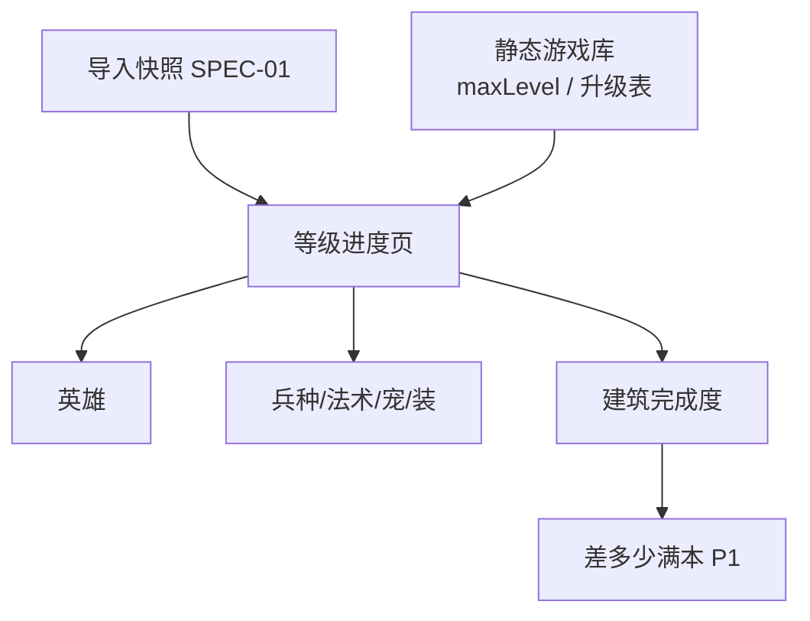

# SPEC-05 · 成长进度

> 状态：Draft · 优先级：**P0（英雄/兵种进度）· P1（满本差距）** · 依赖：SPEC-01（导出数据）；静态游戏库  
> 上游：《功能调研清单》§4C · §4E（BOB 预留）  
> 关联：SPEC-02 展示进行中；本 Spec 回答「还差多少」

---

## 1. 背景与目标

倒计时回答「正在跑的」；进度回答「整体还差多少」。  
MVP 先做**等级进度条**（英雄/兵种/法术/装备/战宠 + 建筑完成度），再做「差多少满本」汇总。

**目标**：

1. 一眼看出哪些单位未满级、差几级。
2. 建筑完成度可量化（百分比）。
3. 为后续规划器保留数据口径，但本 Spec 不做规划。

**非目标**：

- 升级优先级 AI 建议、资源缺口、Ore 追踪、BOB 七条件完整清单（P1/P2 预留见 §10）。
- 玩家间对比、成就、传奇杯（需官方 API，另开 Spec）。

---

## 2. 范围

### In Scope

| 项 | 说明 |
|---|---|
| 英雄进度 | level / maxLevel，红点标未满 |
| 兵种 / 法术 / 装备 / 战宠进度 | 分类列表 + 进度条 |
| 建筑完成度 % | 已升等级总和 / 满级总和 |
| 城墙进度 | 分段墙级（P1） |
| 「差多少满本」 | 剩余升级次数、总时间、总费用（P1，依赖静态库） |
| 按本营过滤 | 「TH16 相关还剩 N 项」（P1） |
| Supercharge | 可选计入权重（P1） |

### Out of Scope

| 项 | 去向 |
|---|---|
| 资源需求汇总 / Ore | 阶段二 |
| 魔法物品计算器 | 阶段二 |
| Rush vs Max 策略对比 | 阶段三 |
| 成就、奖杯、部落 | 需 API，另开 |
| BOB 七条件勾选 | 预留 §10，不进本版 |

---

## 3. 用户与场景

| 场景 | 期望 |
|---|---|
| 女王差 5 级 | 「野蛮人女王 85/95，还差 10 级」 |
| 选下一项实验室 | 看未满级兵种列表 |
| 想知道离满本 | 「建筑完成度 78%，还剩 23 项」 |
| 城墙劝退 | 分段展示 15/16/17 级墙数量 |



---

## 4. 功能需求

### FR-5.1 英雄进度（P0）

| ID | 需求 | 优先级 |
|---|---|---|
| FR-5.1.1 | 列出全部英雄：名称、当前等级、满级、进度条 | P0 |
| FR-5.1.2 | 未满级显示红点 / 「差 N 级」 | P0 |
| FR-5.1.3 | 若英雄正在升级（Job），进度条旁显示「升级中 + 剩余时间」链接到 02 | P0 |
| FR-5.1.4 | 夜世界英雄（战争机器等）分组 | P1 |
| FR-5.1.5 | 装备等级列表（可并列或子页） | P1 |

### FR-5.2 兵种 / 法术 / 战宠（P0）

| ID | 需求 | 优先级 |
|---|---|---|
| FR-5.2.1 | 分类 Tab 或分段：兵种 / 法术 / 战宠 / 装备 | P0 |
| FR-5.2.2 | 每项：名称、当前/满级、进度、是否升级中 | P0 |
| FR-5.2.3 | 默认按「差级数」或「是否未满」排序，可切换 | P1 |
| FR-5.2.4 | 超级兵状态不强制展示（导出/API 可能有 `superTroopIsActive`，非本版必须） | P3 |
| FR-5.2.5 | 筛选：仅看未满 | P1 |

### FR-5.3 建筑完成度（P0）

| ID | 需求 | 优先级 |
|---|---|---|
| FR-5.3.1 | 总完成度 % = Σ(当前等级) / Σ(满级等级) | P0 |
| FR-5.3.2 | 可按类别拆分：防御 / 资源 / 军队 / 陷阱 / 城墙 | P1 |
| FR-5.3.3 | 不含未解锁建筑时的分母策略需固定并说明（见 R-1） | P0 |
| FR-5.3.4 | Supercharge / 季节防御默认不计或单独开关 | P1 |

### FR-5.4 城墙进度（P1）

| ID | 需求 | 优先级 |
|---|---|---|
| FR-5.4.1 | 按墙段等级展示数量分布（如 15 级 40 段、16 级 30 段） | P1 |
| FR-5.4.2 | 墙的完成度与建筑总完成度分开展示（墙权重大） | P1 |
| FR-5.4.3 | 可手动排除城墙（避免打击感） | P2 |

### FR-5.5 差多少满本（P1）

| ID | 需求 | 优先级 |
|---|---|---|
| FR-5.5.1 | 剩余升级次数 | P1 |
| FR-5.5.2 | 估算剩余总时间（静态库 upgrade_time 求和；并行工人口径见 R-2） | P1 |
| FR-5.5.3 | 估算剩余总费用（金/水/黑水分开） | P1 |
| FR-5.5.4 | 明确标注「理论串行/不考虑加速」口径 | P1 |
| FR-5.5.5 | 按本营等级对比：「TH16 还剩 23 项」 | P1 |

### FR-5.6 分享（P2）

| ID | 需求 | 优先级 |
|---|---|---|
| FR-5.6.1 | 生成「完成度证书」文本/图（无私人 tag 可选打码） | P2 |
| FR-5.6.2 | 不上传，默认仅本地分享文件 | P2 |

---

## 5. 规则与算法

### R-1 完成度

```
buildingProgress = sum(level_i) / sum(maxLevel_i)
```

- `maxLevel` 来自静态库；缺失则该建筑不计入分母，并计入 `unmapped`。
- 分母固定为「当前本营可达到的满级」还是「游戏终极满级」：**默认当前 TH 上限**，设置可切换。

### R-2 总时间口径（差多少满本）

| 口径 | 说明 | 用途 |
|---|---|---|
| A. 串行总和 | Σ upgrade_time | 理论上限，简单 |
| B. 多工人粗估 | A / 工人数 | 常用展示 |
| C. 实验室单独 | 兵/法/宠/装时间 | 与建筑工分开 |

MVP 展示 A + B（B 用工人数=建筑工上限，默认 5/6 用户可改）。

### R-3 升级中条目

进行中 Job 显示 `currentLevel → targetLevel`，进度条画到 currentLevel，不预支 targetLevel。

### R-4 静态库缺失

- 无 maxLevel：进度条不定长，只显示 `Lv.12`。
- 无 upgrade_time：总时间显示「资料未覆盖 N 项」而不是 0。

---

## 6. 交互与信息架构

### 6.1 进度页

1. 总览卡：建筑完成度 %、城墙进度、差多少满本摘要
2. Tab：英雄 | 兵种 | 法术 | 战宠 | 装备
3. 筛选：仅未满 / 含升级中
4. 每行右侧可进详情（P2）

### 6.2 与倒计时页关系

- 进度页不做秒级刷新；从倒计时点入时保留筛选。
- 「升级中」徽章可跳回 SPEC-02。

---

## 7. 数据依赖

| 数据 | 来源 | 必要性 |
|---|---|---|
| 各单位当前等级 | SPEC-01 导出 | P0 |
| maxLevel / 中文名 | 静态游戏库 | P0（名称可降级） |
| upgrade_time / cost | 静态游戏库 | P1 |
| TH 上限表 | 静态库 | P1 |
| 进行中升级 | SPEC-01 jobs | P0 |

静态库来源建议：coc.py `static_data.json`（coc.guide）或 Fandom Wiki；需版本字段 `dataVersion`。

---

## 8. 异常与边界

| 场景 | 处理 |
|---|---|
| 静态库未加载 | 只显示当前等级列表，隐藏 % |
| 导出与静态库版本不一致 | 映射失败进入 `unmapped` 列表 |
| 用户未到 TH 上限 | 用当前 TH 上限作 max |
| 超级充能/季节墙 | 默认排除，开关可加 |
| 城墙数量与静态表不符 | 以导出数量为准 |

---

## 9. 验收标准

- [ ] **AC-5.1** 导入样例后，英雄列表等级正确、未满有红点。
- [ ] **AC-5.2** 兵种/法术/战宠分类切换正确。
- [ ] **AC-5.3** 建筑完成度百分比可复现（手算一致，±0.5%）。
- [ ] **AC-5.4** 升级中的英雄在进度页显示进行中，且能跳到倒计时。
- [ ] **AC-5.5** 静态库缺失时不显示虚假 0% 或 0 时间。
- [ ] **AC-5.6** 「仅看未满」筛选有效。
- [ ] **AC-5.7** 城墙分段统计与导出数量一致（P1）。
- [ ] **AC-5.8** 差多少满本的时间/费用口径在 UI 有说明（P1）。
- [ ] **AC-5.9** 断网可用（静态库需本地化或首次缓存）。

---

## 10. 预留（不在本版）

| 功能 | 优先级 | 备注 |
|---|---|---|
| B.O.B / 第 6 建筑工 7 条件清单 | P1 | 需夜世界精确字段 + 手动 |
| 资源缺口汇总 | P2 | 需用户填资源 |
| Ore 追踪 | P2 | |
| 魔法物品价值计算器 | P2 | |
| 升级优先级建议 / AI | P2–P3 | 可接 analyze-player 文案 |
| Left-to-Max 可分享证书 | P2 | |
| 玩家查询（API）成长快照对比 | P2 | 另开 API Spec |

---

## 11. 开放问题

1. 完成度默认分母：当前 TH 上限 vs 全局满级（建议默认当前 TH）。
2. 城墙是否计入总完成度（建议默认不计，单独展示）。
3. 静态库打包体积与更新渠道。
4. 装备与英雄是否同 Tab。
