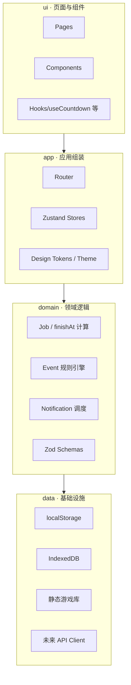
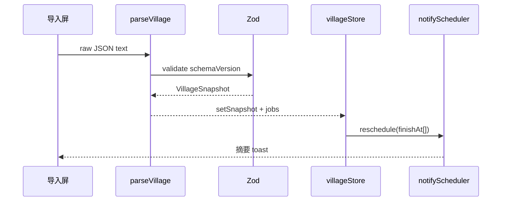

# TECH-SPEC-00 · 前端工程架构

> 状态：Draft · 优先级：P0（工程基线）  
> 决策：**Vite + React + TypeScript + PWA**（正式工程 / 可扩展体量）  
> 上游：功能 SPEC-01～05、UI-SPEC-00～02  
> 本阶段：定架构与约定，**不写业务代码**

---

## 1. 技术选型（已拍板）

| 层 | 选型 | 版本策略 | 理由 |
|---|---|---|---|
| 构建 | **Vite 6+** | 固定 minor，Dependabot/renovate | 秒级 HMR，PWA 插件生态成熟 |
| 框架 | **React 18+** | LTS 心智，函数组件 + Hooks | 多屏状态、倒计时订阅、通知设置表单复杂度足够用 |
| 语言 | **TypeScript 5.x strict** | `strict: true` | 导出 JSON 模型、Job/finishAt 必须可校验 |
| 路由 | **React Router 7**（已拍板） | 迁移成本低，生态大 | Tab + 模态导入 + 子设置页足够 |
| 状态 | **Zustand**（全局）+ React Query **仅在接 API 后** | MVP 全本地，不引入服务端缓存 | 倒计时/快照/设置是客户端单源 |
| 样式 | **CSS Modules + CSS 变量 Token**（已拍板） | Token 对齐 UI-SPEC-00 | 与 Pencil 同名变量一一对应；不用 Tailwind |
| 数据校验 | **Zod** | schemaVersion 兼容 | 解析村庄导出、备份 JSON |
| 本地存储 | **localStorage（设置）+ IndexedDB（快照/备份）** | idb-keyval 或 Dexie | 导出原文与大对象进 IDB |
| 通知 | **Notification API** + 后期 **Web Push（web-push）** | 见 SPEC-03 | 本地路径不依赖后端 |
| PWA | **vite-plugin-pwa**（Workbox） | precache app shell | 离线可用、主屏安装 |
| 测试 | **Vitest + Testing Library + Playwright** | 单测 + 组件 + E2E | 见 §8 |
| 质量 | **ESLint（typescript-eslint）+ Prettier + Husky/lint-staged** | CI 强制 | |
| 包管理 | **pnpm** | 锁文件入库 | 安装快、幽灵依赖少 |

### 1.1 明确不用（本阶段）

| 不用 | 原因 |
|---|---|
| Next.js / SSR | 纯客户端本地工具，无 SEO/SSR 需求 |
| Redux Toolkit | 全局状态面小，Zustand 足够 |
| React Native / Expo | 先 Web PWA；上架再 Capacitor |
| UI 组件库（MUI/AntD） | 视觉已定「夜间工棚」，自建轻组件更贴 Token |
| Tailwind | **明确不用**。避免与 UI-SPEC Token 双轨；复杂卡片/倒计时用 CSS Modules 更贴设计稿 |
| TanStack Router | **不用**。路由面小（约 8 条），RR7 嵌套足够；若未来要复杂搜索参数再评估 |

### 1.2 后续演进预留

| 阶段 | 变化 | 不推倒 |
|---|---|---|
| 第二阶段 | 官方 API 后端代理 + React Query | 数据层接口先抽象 |
| 第三阶段 | 规划器/优化器复杂交互 | 路由与 store 切片已按域拆分 |
| 上架 | **Capacitor** 壳 + APNs/FCM | 前端代码复用，仅加原生工程 |

---

## 2. 架构分层



**依赖方向**：`ui → app → domain → data`，禁止 `domain` 依赖 React。

---

## 3. 目录约定

```text
coc-app/
├── index.html
├── package.json
├── vite.config.ts
├── tsconfig.json
├── public/
│   ├── icons/                 # PWA 多尺寸
│   └── manifest.webmanifest   # 由插件生成或手写
├── src/
│   ├── main.tsx
│   ├── App.tsx
│   ├── app/
│   │   ├── router/
│   │   ├── stores/            # villageStore, settingsStore, notifyStore
│   │   └── providers/
│   ├── domain/
│   │   ├── job/               # Job 模型、finishAt、lane 推断
│   │   ├── village/           # 导出解析、schema
│   │   ├── events/            # 事件规则与 next occurrence
│   │   ├── notify/            # 排程、免打扰、文案
│   │   └── progress/          # 完成度、满本差距
│   ├── data/
│   │   ├── storage/           # idb / localStorage 适配
│   │   ├── static-db/         # 名称、maxLevel、upgrade_time
│   │   └── api/               # 预留，空实现 + 接口类型
│   ├── ui/
│   │   ├── tokens/            # CSS 变量（对齐 UI-SPEC-00）
│   │   ├── components/        # Button, CountDownCard, TabBar…
│   │   ├── screens/           # 对应 UI-SPEC-01 各 P-xx
│   │   └── hooks/             # useNow, useCountdown, useNotification
│   ├── features/              # 可选：按功能再切（import, timer, notify…）
│   ├── styles/
│   └── vite-env.d.ts
├── tests/
│   ├── unit/
│   ├── component/
│   └── e2e/                   # Playwright
└── docs/ → ../specs/          # Spec 即文档源
```

**规则**

1. 页面壳（Tab/安全区）在 `ui/screens/_layout`，业务屏只写内容区。
2. 领域纯函数放 `domain/**`，必须有单测。
3. `data/storage` 之外禁止直接摸 `localStorage` / `indexedDB`。
4. CSS 变量只在 `ui/tokens` 定义；组件不写死色值（调试色除外且登记）。

---

## 4. 状态与数据流

### 4.1 Store 切片

| Store | 职责 | 持久化 |
|---|---|---|
| `villageStore` | 快照、jobs、importedAt、warnings | IDB |
| `settingsStore` | 主题、语言、金卡折扣、工人数 | localStorage |
| `notifyStore` | 开关、提前量、免打扰、schedule 队列 | localStorage |
| `uiStore` | 当前 Tab、Sheet、Toast | 内存 |

### 4.2 关键数据流（导入）



### 4.3 倒计时

- **不**把 `remainingSec` 放进全局高频 store 更新。
- `finishAt` 存绝对时间戳；`useCountdown(finishAt)` 内部用 `requestAnimationFrame`/`setInterval(1s)` + `visibilitychange` 校正。
- 秒级刷新仅订阅中的卡片组件，避免整树重渲染。

### 4.4 Schema 演进

```ts
// domain/village/schema.ts
export const VillageSchema = z.object({
  schemaVersion: z.literal(1),
  // ...
});
export type VillageSnapshot = z.infer<typeof VillageSchema>;
```

- 未知字段：`z.object().passthrough()` 或 `catchall`，与 SPEC-01 FR-1.2.3 一致。
- `schemaVersion` 变更走迁移函数 `migrate(snapshot)`。

---

## 5. 路由结构

| 路径 | 屏 | 备注 |
|---|---|---|
| `/` | P-02 倒计时 | Tab 根 |
| `/progress` | P-04 进度 | |
| `/events` | P-05 事件 | |
| `/settings` | P-07 设置 | |
| `/settings/notifications` | P-06 | 二级 |
| `/settings/data` | 数据管理 | 二级 |
| `/import` | P-01 导入 | 可作全屏 Modal 路由 |
| `/?job=:id` | 打开 P-03 Sheet | 通知深链 |

- 空态：`/` 无数据时渲染 P-00，不另开路由（或 `/?onboarding=1`）。
- 底栏 Tab 保持滚动位置（sessionStorage 记 scrollTop）。

---

## 6. 设计 Token 落地（已拍板：CSS Modules + 变量）

```css
/* src/ui/tokens/colors.css — 与 UI-SPEC-00 一一对应 */
:root {
  --bg: #0C1017;
  --card: #1A2233;
  --ink: #E8ECF4;
  --gold: #F0B429;
  --lab: #8B7CF6;
  --event: #4C9AFF;
  --ok: #3DDC97;
  --warn: #F5A524;
  --danger: #F07178;
  /* …spacing / radius / type */
}
```

```tsx
// ui/components/CountDownCard/CountDownCard.module.css
.card { background: var(--card); border: 1px solid var(--line); border-radius: var(--r-md); padding: 14px 16px; }
.time { font-family: var(--font-num); font-size: 36px; font-weight: 600; font-variant-numeric: tabular-nums; }
```

**样式约定**

| 规则 | 说明 |
|---|---|
| Token 只在 `ui/tokens/*.css` | 组件只消费 `var(--*)` |
| 组件样式用 CSS Modules | `CountDownCard.module.css`，类名局部 |
| 业务差异用 `data-*` / 变体 class | 如 `data-tone="almost"`，不写行内色值 |
| 全局样式仅 `tokens.css` + `base.css` | reset、body、focus-visible |
| 与 Pencil 对齐 | 变量名与 UI-SPEC-00 / Pencil 变量同名 |

- Light 主题 P2：`:root[data-theme="light"]` 覆盖 Token，不改组件 API。

---

## 7. PWA 与通知

| 项 | 实现 |
|---|---|
| manifest | `name: 工头`、`theme_color: #0C1017`、`display: standalone` |
| Service Worker | Workbox precache + 运行时 cache 静态库 JSON |
| 通知权限 | `settings/notifications` 首次引导，禁止启动即弹 |
| 本地排程 | `Notification` + 可见时 `setTimeout`；7 天队列见 SPEC-03 |
| Web Push | 第二阶段：`web-push` 后端 + 订阅端点存 IDB |
| iOS | 文案提示「添加到主屏」；能力探测降级 |

---

## 8. 测试与质量

| 层 | 工具 | 覆盖目标 |
|---|---|---|
| 单元 | Vitest | `parseVillage`、`finishAt`、事件 next、免打扰合并 |
| 组件 | Testing Library | CountDownCard 四态、导入校验错误、开关 |
| E2E | Playwright | 粘贴→导入→倒计时→权限引导 主路径 |
| 视觉 | 可选 Playwright 截图 | 对照 UI-SPEC 移动 390 视口 |
| CI | lint + typecheck + test + build | PR 门禁 |

**必须有的领域测试（对应功能 AC）**

- [ ] `finishAt = importedAt + remainingSec`
- [ ] 重新导入覆盖并重算
- [ ] 事件 UTC → 本地展示
- [ ] 免打扰：静音 / 汇总 / 仅完成
- [ ] schema 未知字段不炸

---

## 9. 性能预算

| 项 | 预算 |
|---|---|
| 首屏 JS（gzip） | ≤ 180KB（含 React） |
| 静态库 | 懒加载或按需 chunk |
| 倒计时重渲染 | 仅订阅节点，1Hz |
| 导入解析 1MB JSON | < 300ms（SPEC-01） |

---

## 10. 安全与合规（工程侧）

1. 不打包任何 Supercell API Token。
2. 纯本地路径零网络请求（PWA 更新除外）。
3. 未来 API 走自有后端；前端只持有会话。
4. 依赖锁 `pnpm-lock.yaml`；定期 `pnpm audit`。
5. 页脚合规文案组件 `LegalFooter` 全局复用。

---

## 11. 工程里程碑（实现顺序建议）

| 里程碑 | 内容 | 对应 Spec |
|---|---|---|
| M0 | 脚手架、Token、Tab 壳、路由 | 本文件 + UI-SPEC |
| M1 | 导入解析 + 存储 | SPEC-01 |
| M2 | 倒计时看板 | SPEC-02 |
| M3 | 通知本地路径 | SPEC-03 |
| M4 | 事件日历 | SPEC-04 |
| M5 | 进度 + 静态库 | SPEC-05 |
| M6 | PWA 完善 + E2E | 本文件 §7–8 |
| M7+ | API 后端、Push、规划器 | 阶段二/三 |

---

## 12. 开放问题

1. ~~路由库~~ **已定：React Router 7**（嵌套路由 + 可选 `createBrowserRouter`）。
2. ~~样式方案~~ **已定：CSS Modules + CSS 变量 Token**（不用 Tailwind）。
3. 静态库体积：打包内置 vs 首次启动下载（建议内置精简版 + 可更新）。
4. 是否 monorepo 预留 `packages/static-db` / `packages/core`（体量大时建议从 M0 就留 workspace）。

---

## 13. 路由装配示例（约定）

```tsx
// app/router/index.tsx
const router = createBrowserRouter([
  {
    path: "/",
    element: <AppShell />,          // StatusBar + TabBar + Outlet
    children: [
      { index: true, element: <TimerPage /> },     // 空数据时内嵌 Empty
      { path: "progress", element: <ProgressPage /> },
      { path: "events", element: <EventsPage /> },
      {
        path: "settings",
        children: [
          { index: true, element: <SettingsPage /> },
          { path: "notifications", element: <NotificationsPage /> },
          { path: "data", element: <DataPage /> },
        ],
      },
    ],
  },
  { path: "/import", element: <ImportModalPage /> },
  { path: "/job/:id", element: <JobSheetPage /> },  // 通知深链
]);
```

- Tab 用 `NavLink`；导入用路由级 Modal（保留返回手势）。
- 查询参 `?job=` 兼容旧深链，重定向到 `/job/:id`。
