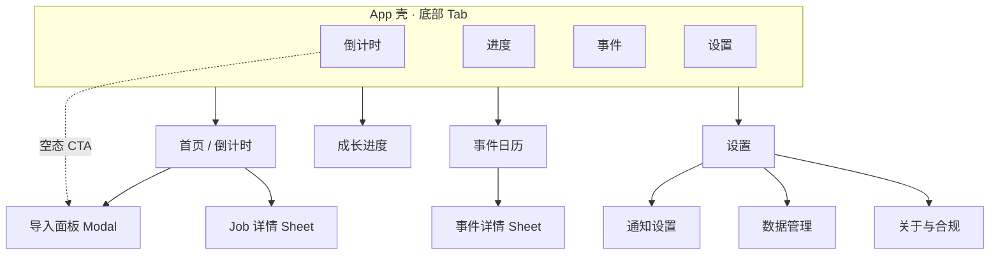
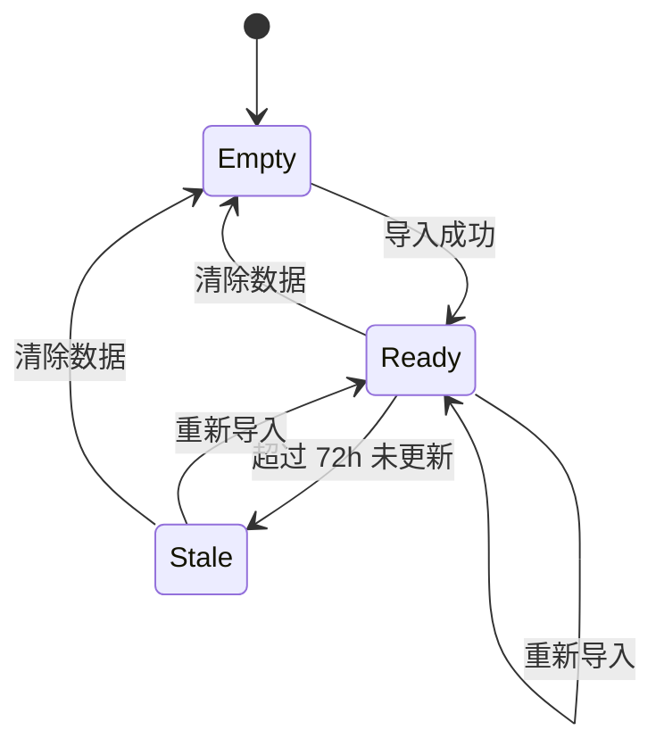

# UI-SPEC-01 · 信息架构与页面

> 状态：Draft · 依赖：UI-SPEC-00 设计系统 · 功能 SPEC-01～05  
> 范围：每个界面有什么功能、怎么排布、关键状态

---

## 1. 信息架构

### 1.1 导航结构



### 1.2 底部 Tab（4 项）

| Tab | 图标意象 | 默认落地 | 徽章 |
|---|---|---|---|
| **倒计时** | 工人/时钟 | Builder+Lab 看板 | 有完成/将完成时金点 |
| **进度** | 双环进度 | 英雄/兵种列表 | 无 |
| **事件** | 日历 | 下一事件大卡+列表 | 今日有事件则蓝点 |
| **设置** | 齿轮 | 列表入口 | 通知权限被拒时红点 |

> 首版不做侧栏；导入是 Modal，不占 Tab。

### 1.3 全局壳层

| 区 | 内容 |
|---|---|
| 顶栏 | 左：村庄名（可改）/ 中：页面标题 / 右：更多（导入、清除） |
| 状态条 | `数据更新于 X 前`；陈旧时 `--warn`，可点进导入 |
| 底栏 | 4 Tab + safe-area |
| Toast | 操作反馈 |
| Modal / Sheet | 导入、详情、确认 |

---

## 2. 页面清单总表

| ID | 页面 | 主任务 | 对应功能 Spec | 优先级 |
|---|---|---|---|---|
| P-00 | 首次启动 / 空态 | 引导导入 | SPEC-01 | P0 |
| P-01 | 导入村庄数据 | 粘贴→解析→确认 | SPEC-01 | P0 |
| P-02 | 倒计时首页 | 看工人/实验室剩余 | SPEC-02 | P0 |
| P-03 | Job 详情 Sheet | 看单条完成时刻 | SPEC-02 | P1 |
| P-04 | 成长进度 | 看差多少满级 | SPEC-05 | P0 |
| P-05 | 事件日历 | 看下一事件 | SPEC-04 | P0 |
| P-06 | 通知设置 | 管提醒 | SPEC-03 | P0 |
| P-07 | 数据管理 | 备份/清除 | SPEC-01 | P1 |
| P-08 | 关于与合规 | 声明 | 合规 | P0 |

---

## 3. 页面详设

### P-00 首次启动 / 空态（倒计时 Tab 空数据）

**功能**

| # | 功能 | 说明 |
|---|---|---|
| 1 | 价值主张 | 「工人还剩多久 · 到点叫你」 |
| 2 | 三步引导 | ① 游戏内 Copy ② 这里粘贴 ③ 看倒计时 |
| 3 | 主 CTA | 「粘贴村庄数据」→ P-01 |
| 4 | 次 CTA | 「用示例数据看看」 |
| 5 | 合规脚注 | 非官方、数据仅存本机 |

**线框**

```
┌──────────────────────────────┐
│  工头                         │
│                              │
│         ◔  (空态线稿)         │
│   工人还剩多久 · 到点叫你       │
│                              │
│  ① 游戏 → 设置 → 更多设置     │
│  ② Data Export → Copy        │
│  ③ 粘贴到这里                │
│                              │
│  ┌────────────────────────┐  │
│  │     粘贴村庄数据         │  │
│  └────────────────────────┘  │
│        用示例数据看看          │
│  非官方粉丝工具 · 数据仅存本机  │
├──────────────────────────────┤
│  [倒计时] [进度] [事件] [设置] │
└──────────────────────────────┘
```

**状态**：空态唯一版本；有数据后不再显示。

---

### P-01 导入村庄数据（Modal 全屏）

**功能**

| # | 功能 | Spec |
|---|---|---|
| 1 | 顶部关闭 + 标题「导入村庄数据」 | — |
| 2 | 可折叠操作说明 + 深链按钮「打开游戏设置」 | FR-1.1.3 |
| 3 | 大文本框（等宽字体，≥12 行） | FR-1.1.1 |
| 4 | 「从剪贴板粘贴」 | FR-1.1.2 |
| 5 | 「选择 .json 文件」 | FR-1.1.5 |
| 6 | 解析预览：N 项进行中 / 警告列表 | FR-1.2 |
| 7 | 主按钮「解析并导入」/ 确认后写入 | FR-1.4 |
| 8 | 失败错误文案 + 「查看示例」 | FR-1.2.1 |

**线框**

```
┌──────────────────────────────┐
│ ✕  导入村庄数据                │
├──────────────────────────────┤
│ ▸ 怎么复制？（展开说明）        │
│   [打开游戏设置]               │
│                              │
│ ┌──────────────────────────┐ │
│ │  粘贴 Data Export 内容…   │ │
│ │  (等宽 · 可滚动)          │ │
│ └──────────────────────────┘ │
│  [从剪贴板粘贴] [选文件]       │
│                              │
│ ┌ 预览 ────────────────────┐ │
│ │ 识别 5 项进行中 · 2 警告   │ │
│ │ · 缺少 helpers           │ │
│ └──────────────────────────┘ │
│                              │
│  ┌────────────────────────┐  │
│  │      解析并导入          │  │
│  └────────────────────────┘  │
└──────────────────────────────┘
```

**状态**

| 状态 | 表现 |
|---|---|
| 空输入 | 主按钮 disabled |
| 解析中 | 按钮 loading，禁重复点 |
| 预览成功 | 显示摘要，主按钮变「确认导入」 |
| 失败 | `--danger` 信息条 + 输入保留 |
| 覆盖导入 | 二次确认「将覆盖当前数据」 |

---

### P-02 倒计时首页（核心）

**功能**

| # | 功能 | Spec |
|---|---|---|
| 1 | 顶栏：村庄名、数据更新于、更多 | FR-1.5 |
| 2 | 总览条：最早完成倒计时 + N 个工人 + 实验室一句话 | FR-2.4.3 |
| 3 | **建筑工区**：升级卡片列表 | FR-2.1 |
| 4 | **实验室区**：研究卡片 | FR-2.2 |
| 5 | 哥布林工/助手分组 | FR-2.5 |
| 6 | Boost 区：药水/钟楼剩余 + 已校准角标 | FR-2.5.3 |
| 7 | 夜世界折叠 | FR-2.6 |
| 8 | 局限脚注：「加速/Forge 可能与游戏略有偏差」 | 诚实数据 |
| 9 | 空态：去导入 | P-00 |

**线框**

```
┌──────────────────────────────┐
│ 主号▾     倒计时        ⋯     │
│ ▔▔▔▔▔▔▔▔▔▔▔▔▔▔▔▔▔▔▔▔▔▔▔▔ │
│ ⏱ 最早 01:12:45  工人 5 · 实验室研究中 │
├──────────────────────────────┤
│  建筑工                        │
│ ┌──────────────────────────┐ │
│ │ 🟡 箭塔            升级中 │ │
│ │    11 → 12               │ │
│ │    2天 03:15              │ │  ← display-time
│ │    ▓▓▓▓▓░░░░░  完成 21:35 │ │
│ └──────────────────────────┘ │
│ ┌──────────────────────────┐ │
│ │ 🟡 巨石碑  10→11  06:20:11│ │
│ └──────────────────────────┘ │
│                              │
│  实验室                       │
│ ┌──────────────────────────┐ │
│ │ 🟣 野蛮人  12→13  研究中  │ │
│ │    5小时 22分             │ │
│ └──────────────────────────┘ │
│                              │
│  ▸ 其他（哥布林工 · 助手）     │
│  ▸ 加速状态（工人药水 1:20）   │
│  ▸ 夜世界                     │
│  * 加速可能导致实际更早完成     │
├──────────────────────────────┤
│  [倒计时●] [进度] [事件] [设置] │
└──────────────────────────────┘
```

**卡片结构（倒计时卡）**

| 元素 | 样式 |
|---|---|
| lane 色条 / 图标 | 建筑金 `--gold`，实验室紫 `--lab` |
| 名称 | `title-sm` |
| 等级变化 | `caption` `11 → 12` |
| **剩余时间** | `display-time` + `--font-num` |
| 进度条 | 线性 6px，`r-pill`；≤5min 转 `--warn` |
| 绝对完成时刻 | `caption`，点按展开 P-03 |
| 已完成 | 整卡 opacity 0.55 + `--ok` 徽章「已完成」 |

**状态**

| 状态 | 表现 |
|---|---|
| 进行中 | 默认 |
| ≤5 分钟 | 时间变 `--warn`，进度条微光（不闪） |
| 已完成 | 见上，仍保留到重新导入 |
| 数据陈旧 >24h/72h | 状态条黄/橙 + 「重新导入」 |
| 空建筑工 | 「没有进行中的建筑升级」 |
| 空实验室 | 「实验室空闲」 |
| 时间异常 | 顶部警告「设备时间可能不准确」 |

**交互**

- 卡片单击 → P-03 Sheet
- 总览条单击 → 跳到最先完成的卡片（scrollTo）
- `⋯` 菜单：重新导入 / 示例 / 清除

---

### P-03 Job 详情（Bottom Sheet）

**功能**

| # | 功能 |
|---|---|
| 1 | 名称 + 等级变化 + lane 徽章 |
| 2 | 大号剩余时间 + 绝对完成时刻（本地时区） |
| 3 | 元信息：导入时间、来源（导出/手动）、itemId |
| 4 | Boost 影响说明（若相关） |
| 5 | 操作：静音此条（P2）、复制完成时刻（P2） |

**线框**

```
┌──────────────────────────────┐
│ ────（拖拽把手）               │
│  箭塔  11 → 12     [建筑工]    │
│  2天 03:15                    │
│  预计完成 9月30日 21:35        │
│ ──────────────────────────── │
│  导入于 今天 12:00 · 来源：导出 │
│  任务 #1000001                │
│  * 若使用加速可能更早完成       │
│                              │
│  [关闭]                       │
└──────────────────────────────┘
```

---

### P-04 成长进度

**功能**

| # | 功能 | Spec |
|---|---|---|
| 1 | 总览卡：建筑完成度 %、城墙、差多少满本摘要 | FR-5.3 / 5.5 |
| 2 | Tab：英雄 \| 兵种 \| 法术 \| 战宠 \| 装备 | FR-5.2 |
| 3 | 筛选 chips：全部 / 仅未满 / 含升级中 | FR-5.2.5 |
| 4 | 列表行：名称、Lv.x / max、进度条、红点、升级中徽章 | FR-5.1 |
| 5 | 点行 → 跳倒计时（若升级中）或展开下一级资料 | — |
| 6 | 口径说明脚注（TH 上限 / 不计城墙） | R-1 |

**线框**

```
┌──────────────────────────────┐
│ 进度                          │
│ ┌──────────────────────────┐ │
│ │ 建筑完成度          78%   │ │
│ │ ▓▓▓▓▓▓▓▓░░░░             │ │
│ │ 城墙 15级 40 · 16级 30    │ │
│ │ 差多少满本 · 还剩 23 项    │ │
│ └──────────────────────────┘ │
│ [英雄][兵种][法术][战宠][装备] │
│ (全部)(仅未满)(含升级中)      │
│ ┌──────────────────────────┐ │
│ │ 野蛮人女王   85/95  ●差10│ │
│ │ ▓▓▓▓▓▓▓▓▓░░░░░░          │ │
│ │ 幻影猎手     40/40  ✓满  │ │
│ │ 野蛮人  12/13  升级中 2天 │ │
│ └──────────────────────────┘ │
├──────────────────────────────┤
│  [倒计时] [进度●] [事件] [设置] │
└──────────────────────────────┘
```

**列表行状态**

| 状态 | 表现 |
|---|---|
| 未满 | 红点 `--danger` 小圆 + 「差 N 级」 |
| 升级中 | `--gold` 徽章 + 剩余时间短文案 |
| 已满 | `--ok` 对勾，弱化 |
| 无 maxLevel | 只显示 `Lv.12`，无条 |

---

### P-05 事件日历

**功能**

| # | 功能 | Spec |
|---|---|---|
| 1 | 「下一个」Hero 大卡：名称、剩余、开始时间 | FR-4.2.4 |
| 2 | 进行中列表高亮 | FR-4.2.3 |
| 3 | 即将发生 / 已结束分组 | FR-4.2 |
| 4 | 事件行：名称、窗口、剩余、类型色点 | FR-4.2.2 |
| 5 | 点行 → Sheet：说明 + 建议文案 + 通知开关 | FR-4.2.5 |
| 6 | 右上进入事件通知偏好 | FR-4.6 |
| 7 | `approximate` 事件「以游戏内为准」标签 | FR-4.1.4 |

**线框**

```
┌──────────────────────────────┐
│ 事件                    🔔   │
│ ┌──────────────────────────┐ │
│ │ 下一个事件        蓝点事件 │ │
│ │  部落冲突                │ │
│ │  还有 2天 03:15           │ │
│ │  10月22日 16:00 开始      │ │
│ └──────────────────────────┘ │
│  进行中                       │
│ ┌──────────────────────────┐ │
│ │ ● 赛季结束 · 今天 16:00   │ │
│ └──────────────────────────┘ │
│  即将发生                     │
│ │ ● 部落冲突  10/22-10/28   │ │
│ │ ● CWL 报名  11/01 起 2 天 │ │
│  已结束 ▾                     │
├──────────────────────────────┤
│  [倒计时] [进度] [事件●] [设置] │
└──────────────────────────────┘
```

**类型色点**：赛季/结算 `--gold` · 部落冲突/CWL `--event` · 都城 `--lab` · 刷新类 `--ink-3`。

---

### P-06 通知设置

**功能**

| # | 功能 | Spec |
|---|---|---|
| 1 | 权限状态卡 + 主 CTA | FR-3.1 |
| 2 | 默认提前量（分段/下拉） | FR-3.3 |
| 3 | 分组开关：建筑工/实验室/其他/事件 | FR-3.4 |
| 4 | 免打扰时段 + 策略 | FR-3.4.3 |
| 5 | 声音开关 | FR-3.5.2 |
| 6 | 通知历史（P2） | — |
| 7 | 导出 ICS（P2） | FR-3.7 |
| 8 | 说明：「系统可能延迟；iOS 需添加到主屏」 | FR-3.1.4 |

**线框**

```
┌──────────────────────────────┐
│ ‹ 通知                        │
│ ┌──────────────────────────┐ │
│ │ 系统通知未开启      [去开启]│ │
│ │ 倒计时仍可正常使用          │ │
│ └──────────────────────────┘ │
│  提前提醒                     │
│  (关)(5分)(15分●)(1小时)      │
│  通知类型                     │
│  建筑工完成         (●──○)    │
│  实验室完成         (●──○)    │
│  其他进行中         (●──○)    │
│  公开事件           (●──○)    │
│  免打扰  23:00–07:00  (●──○) │
│  策略：完全静音 ▾             │
│  * 提醒可能因省电策略延迟      │
└──────────────────────────────┘
```

---

### P-07 数据管理（设置子页）

**功能**

| # | 功能 | Spec |
|---|---|---|
| 1 | 显示当前快照时间、Job 数、占用大小 | FR-1.4 |
| 2 | 重新导入 | — |
| 3 | 导出备份 JSON | FR-1.4.5 |
| 4 | 导入备份 | FR-1.4.5 |
| 5 | 清除本地数据（危险，二次确认） | FR-1.4.4 |
| 6 | 静态库版本号 | SPEC-05 |

---

### P-08 关于与合规

| # | 功能 |
|---|---|
| 1 | 产品名、版本 |
| 2 | **非官方声明** + Supercell Fan Content Policy 链接 |
| 3 | 「数据仅存本机，不上传」 |
| 4 | 数据来源列表（游戏导出 / 公开资料） |
| 5 | 开源/第三方致谢（静态库） |
| 6 | 反馈入口（可选） |

**页脚短句（全局可复用）**  
`非官方粉丝工具 · 不隶属于 Supercell · 数据仅存本机`

---

## 4. 设置首页（列表页，挂在 Tab「设置」）

| 分组 | 项 | 去向 |
|---|---|---|
| 数据 | 导入村庄数据 / 数据管理 | P-01 / P-07 |
| 提醒 | 通知设置 | P-06 |
| 显示 | 主题（P2）、语言（P2） | — |
| 其他 | 关于与合规 | P-08 |
| 危险 | 清除本地数据 | P-07 |

---

## 5. 跨页面状态机



| 状态 | 影响 |
|---|---|
| Empty | P-00 空态；进度/事件可浏览事件 |
| Ready | P-02 全量卡片 |
| Stale | 状态条警告；通知仍按旧 finishAt 可能不准 |

---

## 6. 导航与手势

| 交互 | 行为 |
|---|---|
| 底栏切换 | 保持各 Tab 滚动位置（同会话） |
| Sheet | 下滑关闭；遮罩点击关闭 |
| Modal 导入 | 不可误滑关；显式 ✕ / 返回 |
| 确认清除 | 双按钮：取消（安全区近侧）/ 确认清除（danger） |

---

## 7. 空 / 错 / 加载统一模式

| 模式 | 组件 |
|---|---|
| 空 | 线稿插画 + 一句话 + 主 CTA |
| 错 | `--danger` 信息条 + 建议动作 |
| 加载 | 骨架屏（卡片灰块），不转圈遮全屏 |
| 成功 | Toast 2.5s |

---

## 8. 页面验收（UI）

- [ ] 375px 宽下 P-02 无需横向滚动
- [ ] 倒计时数字为页面最醒目元素
- [ ] 金/紫/蓝可在建筑工/实验室/事件间一眼区分
- [ ] 空态 → 导入 → 首页 全程 ≤ 3 次点击
- [ ] 每个 Tab 有明确空态
- [ ] 破坏性操作（清除）需二次确认
- [ ] 合规声明在设置可发现，页脚短句至少在首页或关于出现
- [ ] 与 UI-SPEC-00 Token 一致，无裸写 `#hex` 例外（需登记）
